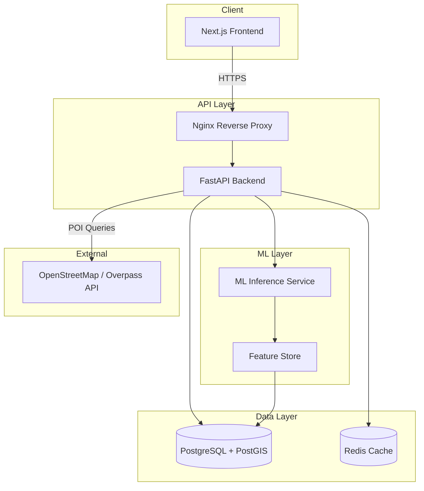

# DataSage — The AI Behind Better Buys

> AI-powered real-estate decision-support platform for residential properties in Delhi-NCR, India.

[](LICENSE)

---

## What Is DataSage?

DataSage helps home buyers, investors, and real-estate professionals make confident property decisions by combining **machine-learning valuation models**, **geospatial intelligence from OpenStreetMap**, and **explainable AI** into a single platform.

### The 10 Questions DataSage Answers

| # | Question | How |
|---|----------|-----|
| 1 | Is this property fairly priced? | ML valuation model compared to listing price |
| 2 | Overpriced or underpriced? | Price-gap classification with confidence intervals |
| 3 | What's the estimated fair market value? | Gradient-boosted regression on structural + locational features |
| 4 | How good is the location? | Composite location score from OSM proximity analysis |
| 5 | What's nearby? | Schools, hospitals, transit, parks, shopping via Overpass API |
| 6 | Does it fit my budget and lifestyle? | Preference-based suitability scoring |
| 7 | Investment potential? | Appreciation signals, infrastructure growth, rental yield estimates |
| 8 | Strengths and weaknesses? | SHAP-based feature contribution breakdown |
| 9 | Similar properties to consider? | Content-based recommendation engine |
| 10 | Why this recommendation? | Natural-language explanations per recommendation |

---

## Architecture Overview



---

## Tech Stack

| Layer | Technology | Why |
|-------|-----------|-----|
| Frontend | Next.js 14 (React) | SSR/SSG, file-based routing, strong ecosystem |
| Backend | FastAPI (Python 3.11+) | Async-first, auto OpenAPI docs, native ML ecosystem |
| Database | PostgreSQL 16 + PostGIS 3.4 | Mature RDBMS, geospatial queries, JSONB for flexible fields |
| Cache | Redis 7 | Session cache, rate limiting, ML prediction cache |
| ML | scikit-learn, XGBoost, SHAP | Production-proven, interpretable, fast inference |
| Maps | Leaflet + OpenStreetMap | Free, no API key limits, rich POI data |
| Containerization | Docker + Docker Compose | Reproducible environments, easy local dev |
| Reverse Proxy | Nginx | TLS termination, static asset serving, rate limiting |

---

## Quickstart

### Prerequisites

- Docker Desktop ≥ 24.0
- Docker Compose ≥ 2.20
- Node.js ≥ 18 (for frontend dev outside Docker)
- Python ≥ 3.11 (for backend dev outside Docker)

### 1. Clone and Configure

```bash
git clone https://github.com/your-org/datasage.git
cd datasage
cp .env.example .env
# Edit .env with your local settings
```

### 2. Start All Services

```bash
docker compose up -d
```

### 3. Access the Application

| Service | URL |
|---------|-----|
| Frontend | http://localhost:3000 |
| Backend API | http://localhost:8000 |
| API Docs (Swagger) | http://localhost:8000/docs |
| API Docs (ReDoc) | http://localhost:8000/redoc |

### 4. Seed Demo Data

```bash
docker compose exec backend python -m datasage.cli seed --demo
```

> **Note**: Seed data is synthetic and clearly labeled. It does not represent real property listings.

---

## Project Structure

```
DataSage/
├── docs/                    # All project documentation (see below)
├── frontend/                # Next.js application
├── backend/                 # FastAPI application
│   ├── datasage/
│   │   ├── api/             # Route handlers
│   │   ├── core/            # Config, security, dependencies
│   │   ├── models/          # SQLAlchemy ORM models
│   │   ├── schemas/         # Pydantic request/response schemas
│   │   ├── services/        # Business logic
│   │   ├── ml/              # ML models, feature engineering, inference
│   │   ├── geo/             # Geospatial services (PostGIS, OSM)
│   │   └── cli/             # Management commands
│   ├── migrations/          # Alembic migrations
│   └── tests/
├── ml/                      # ML training pipeline (offline)
│   ├── notebooks/           # Exploration notebooks
│   ├── training/            # Training scripts
│   ├── evaluation/          # Model evaluation
│   └── models/              # Serialized model artifacts
├── data/
│   ├── seed/                # Demo/seed datasets (labeled as synthetic)
│   └── raw/                 # Raw data downloads (gitignored)
├── docker/                  # Dockerfiles per service
├── nginx/                   # Nginx config
├── docker-compose.yml
├── .env.example
├── README.md
├── CHANGELOG.md
└── LICENSE
```

---

## Documentation Index

| # | Document | Description |
|---|----------|-------------|
| 00 | [Project Overview](docs/00-project-overview.md) | Vision, scope, capabilities |
| 01 | [Product Requirements](docs/01-product-requirements.md) | Source requirements, assumptions |
| 02 | [User Personas](docs/02-user-personas.md) | Buyer, investor, professional, admin |
| 03 | [User Flows](docs/03-user-flows.md) | 6 complete user journeys |
| 04 | [Functional Requirements](docs/04-functional-requirements.md) | Module-level requirements |
| 05 | [Non-Functional Requirements](docs/05-non-functional-requirements.md) | Performance, scalability, availability |
| 06 | [System Architecture](docs/06-system-architecture.md) | High-level design, tech choices |
| 07 | [Frontend Architecture](docs/07-frontend-architecture.md) | Next.js structure, state, maps |
| 08 | [Backend Architecture](docs/08-backend-architecture.md) | FastAPI layers, services, async |
| 09 | [Database Design](docs/09-database-design.md) | ERD, tables, PostGIS, indexes |
| 10 | [API Specification](docs/10-api-specification.md) | Endpoints, schemas, versioning |
| 11 | [Auth & Authorization](docs/11-authentication-authorization.md) | JWT, RBAC, permissions |
| 12 | [ML System Design](docs/12-ml-system-design.md) | Pipeline, model selection, serving |
| 13 | [Feature Engineering](docs/13-ml-feature-engineering.md) | Feature catalog, encoding, store |
| 14 | [Geospatial System](docs/14-geospatial-system.md) | PostGIS, OSM, location scoring |
| 15 | [Recommendation Engine](docs/15-recommendation-engine.md) | Filtering, scoring, ranking |
| 16 | [Explainable AI](docs/16-explainable-ai.md) | SHAP, explanations, templates |
| 17 | [Data Ingestion](docs/17-data-ingestion-pipeline.md) | ETL, scheduling, sources |
| 18 | [Data Quality](docs/18-data-quality.md) | Validation, profiling, quarantine |
| 19 | [Security](docs/19-security.md) | OWASP, input validation, secrets |
| 20 | [Privacy](docs/20-privacy.md) | PII, retention, consent |
| 21 | [Error Handling](docs/21-error-handling.md) | Error taxonomy, codes, degradation |
| 22 | [Observability](docs/22-observability.md) | Logging, metrics, tracing |
| 23 | [Testing Strategy](docs/23-testing-strategy.md) | Test pyramid, ML testing |
| 24 | [Deployment](docs/24-deployment.md) | CI/CD, Docker, rollback |
| 25 | [Environment Config](docs/25-environment-configuration.md) | Env hierarchy, feature flags |
| 26 | [Project Structure](docs/26-project-structure.md) | Directory layout, conventions |
| 27 | [Development Roadmap](docs/27-development-roadmap.md) | Phases, milestones, timeline |
| 28 | [MVP vs Future Scope](docs/28-mvp-vs-future-scope.md) | Feature boundary, expansion |
| 29 | [Risks & Assumptions](docs/29-risks-and-assumptions.md) | Risk register, mitigations |
| 30 | [Acceptance Criteria](docs/30-acceptance-criteria.md) | Per-module criteria |
| 31 | [AI Agent Rules](docs/31-ai-agent-rules.md) | Coding conventions for AI agents |
| 32 | [Contributing](docs/32-contributing.md) | Workflow, reviews, standards |

---

## Geographic Scope

**MVP**: Delhi-NCR (Delhi, Gurgaon, Noida, Greater Noida, Faridabad, Ghaziabad)

**Future**: The architecture uses city-scoped data partitioning and configurable geofences, allowing additional Indian cities to be added without system rewrites. See [MVP vs Future Scope](docs/28-mvp-vs-future-scope.md).

---

## Data Integrity Notice

- All demo/seed data is **synthetic** and clearly labeled as such.
- DataSage does **not** claim access to any commercial property portal API unless explicitly documented.
- ML accuracy metrics are reported from actual model evaluation — never fabricated.
- Property listings shown in development mode are **demo data for testing purposes only**.

---

## License

This project is licensed under the MIT License — see [LICENSE](LICENSE) for details.
