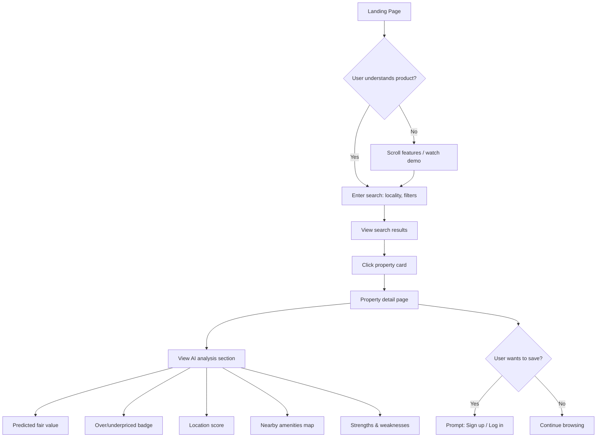
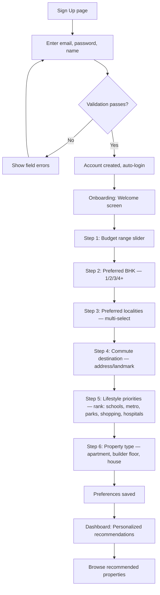
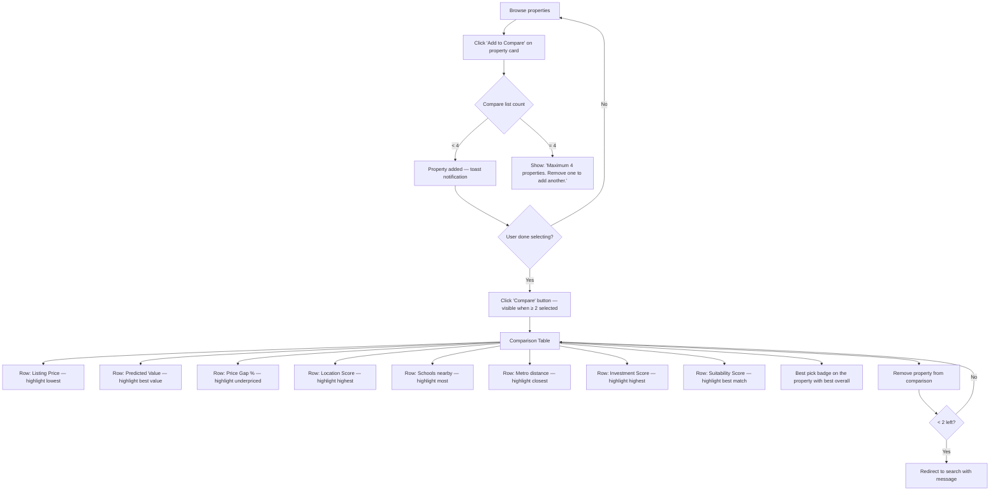
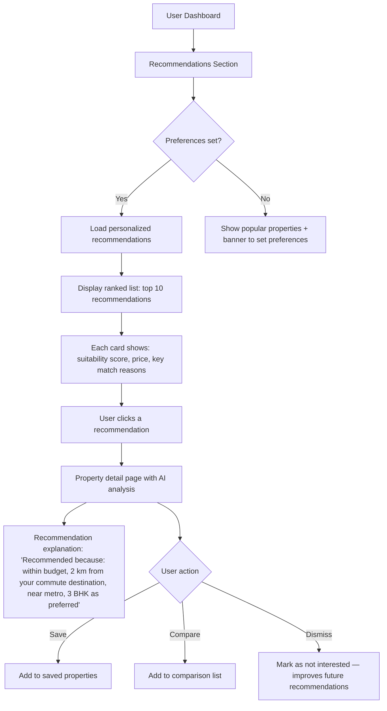

# 03 — User Flows

## Overview

This document defines 6 complete user flows with Mermaid diagrams. Each flow covers the happy path, alternate paths, validation errors, empty states, unauthorized states, and failure states.

---

## Flow 1: Discovery & Property Analysis (Unauthenticated)

**Actor**: Any visitor (no login required for basic search)
**Goal**: Understand the product, search for properties, view AI analysis

### Happy Path

### Alternate Paths

| Condition | Behavior |
|-----------|----------|
| User searches without filters | Show all properties in the locality, sorted by relevance |
| User applies many filters | Show results if any match; show empty state if none |
| User wants to compare | Prompt sign-up: "Create a free account to compare properties" |

### Error & Edge States

| State | Trigger | UX Response |
|-------|---------|-------------|
| Empty results | No properties match search criteria | Show: "No properties found in [locality] matching your filters. Try broadening your search." Suggest nearby localities. |
| Search too broad | Locality not recognized | Show autocomplete suggestions. If no match: "We don't have data for this area yet. DataSage currently covers Delhi-NCR." |
| API error | Backend unreachable or timeout | Show: "We're having trouble loading results. Please try again." Retry button. |
| ML prediction unavailable | Model error or missing features | Show property details without AI section. Banner: "AI analysis is temporarily unavailable for this property." |
| Rate limited | Too many searches in short time | Show: "You're searching faster than we can keep up. Please wait a moment." |

---

## Flow 2: Registration, Onboarding & Personalized Recommendations

**Actor**: New visitor → registered user
**Goal**: Create account, set preferences, receive personalized recommendations

### Happy Path

### Alternate Paths

| Condition | Behavior |
|-----------|----------|
| User skips onboarding | Redirect to dashboard with generic/popular recommendations. Show persistent banner: "Set your preferences for personalized recommendations." |
| User skips individual steps | Store partial preferences. Recommendation engine uses defaults for missing fields. |
| User modifies preferences later | Profile → Preferences page allows full re-configuration. Recommendations refresh on next visit. |
| User already has account | Redirect to login page with "Already have an account?" link |

### Validation Errors

| Field | Validation Rule | Error Message |
|-------|----------------|---------------|
| Email | Valid email format, not already registered | "Please enter a valid email" / "An account with this email already exists" |
| Password | ≥ 8 chars, 1 uppercase, 1 digit | "Password must be at least 8 characters with 1 uppercase letter and 1 number" |
| Name | 2–100 chars, alphanumeric + spaces | "Name must be 2–100 characters" |
| Budget | Min < Max, both > 0 | "Minimum budget must be less than maximum" |
| Localities | ≥ 1 selected | "Please select at least one preferred locality" |

### Error States

| State | Trigger | UX Response |
|-------|---------|-------------|
| Registration failure | Server error during account creation | "Something went wrong. Please try again." Log error server-side. |
| Duplicate email | Email already exists | "An account with this email already exists. [Log in instead?]" |
| Onboarding save failure | Preference save fails | "We couldn't save your preferences. [Retry]" — preferences form remains populated. |

---

## Flow 3: Property Analysis (Full AI Analysis)

**Actor**: Authenticated user (buyer or investor)
**Goal**: Deep-dive into a property's AI-generated analysis

### Happy Path

```mermaid
flowchart TD
    A[Property Detail Page] --> B[Hero: Images + Basic Info]
    B --> C[Section: Pricing Analysis]
    C --> C1["Listing Price: ₹72L"]
    C --> C2["Predicted Fair Value: ₹65L ± ₹4L"]
    C --> C3["Classification: Overpriced by 10.8%"]
    C --> C4[Confidence: High]
    B --> D[Section: Location Intelligence]
    D --> D1["Location Score: 74/100"]
    D --> D2["Sub-scores: Transit 85, Schools 70, Healthcare 65, Shopping 78"]
    D --> D3[Interactive map with POI markers]
    D --> D4["Nearest metro: 1.2 km — Rajiv Chowk"]
    D --> D5["Schools within 2 km: 4"]
    D --> D6["Hospitals within 3 km: 2"]
    B --> E[Section: Investment Analysis]
    E --> E1["Investment Score: 62/100"]
    E --> E2["Locality trend: +6% YoY"]
    E --> E3["Estimated rental yield: 2.8%"]
    E --> E4["Infrastructure: Metro Phase 4 — 2.5 km"]
    B --> F[Section: AI Explanation]
    F --> F1["Top positive factors: Metro proximity, recent construction"]
    F --> F2["Top negative factors: North-facing, ground floor, no parking"]
    F --> F3[Feature contribution bar chart]
    B --> G[Section: Similar Properties]
    G --> G1[3–5 comparable properties with key metrics]
    B --> H[Actions]
    H --> H1[Save Property]
    H --> H2[Add to Comparison]
    H --> H3[Share]
```

### Data States

| State | Trigger | UX Response |
|-------|---------|-------------|
| Full data available | All features present, model confident | Show complete analysis with all sections |
| Partial data | Some features missing (e.g., floor, age) | Show available analysis. Missing sections display: "Insufficient data for [section]. This property is missing: [list]." |
| Low confidence | Model confidence below threshold (0.6) | Show prediction with warning: "This estimate has low confidence due to limited comparable data in this locality." |
| No valuation possible | Critical features missing or property type unsupported | Hide pricing section. Show: "AI valuation is not available for this property type." |
| OSM data sparse | Few POIs found in the area | Show available POIs. Note: "OpenStreetMap coverage for this area may be incomplete." |

---

## Flow 4: Property Comparison

**Actor**: Authenticated user
**Goal**: Compare 2–4 properties side-by-side

### Happy Path

### Edge States

| State | Trigger | UX Response |
|-------|---------|-------------|
| Only 1 property selected | User clicks Compare with 1 property | Button disabled. Tooltip: "Select at least 2 properties to compare." |
| Property removed from dataset | Admin deactivates a property while user is comparing | On next comparison load: "1 property is no longer available. [Remove from comparison]" |
| Mismatched property types | User compares a 1BHK apartment with a 4BHK house | Comparison still works — differences highlighted. Banner: "You're comparing very different property types. Results may be less meaningful." |

---

## Flow 5: Recommendation Flow

**Actor**: Authenticated user with preferences set
**Goal**: Receive and act on personalized property recommendations

### Happy Path

### Cold Start Handling

| Scenario | Behavior |
|----------|----------|
| New user, no preferences | Show top 10 most-viewed properties in Delhi-NCR. Banner: "Set your preferences to get recommendations tailored to you." |
| Preferences set, no matching properties | "No properties currently match all your criteria. Here are the closest matches." Show top 5 with relaxed constraints, note which criteria were relaxed. |
| Preferences set, <3 matching properties | Show matching properties + "See more" with slightly relaxed criteria. |

### Recommendation Rejection

| Action | System Response |
|--------|----------------|
| User dismisses a recommendation | Record negative signal. Property deprioritized in future. |
| User saves a recommendation | Record positive signal. Similar properties boosted. |
| User dismisses multiple recommendations | After 5 dismissals, prompt: "Your recommendations don't seem right. [Update preferences?]" |

---

## Flow 6: Admin Dashboard

**Actor**: Sneha (Platform Administrator)
**Goal**: Monitor and manage the platform

### Happy Path

```mermaid
flowchart TD
    A[Admin Login] --> B{Is admin role?}
    B -->|No| C[Redirect to user dashboard — 403 Forbidden]
    B -->|Yes| D[Admin Dashboard]
    D --> E[Section: System Health]
    E --> E1["API Latency p50/p95/p99"]
    E --> E2["Error rate last 24h"]
    E --> E3["Active users last 24h"]
    E --> E4["Total properties in dataset"]
    D --> F[Section: Dataset Management]
    F --> F1[List datasets with status: active, draft, archived]
    F --> F2[Upload new dataset — CSV/JSON]
    F --> F3[View import history]
    F --> F4[Trigger data quality check]
    D --> G[Section: Data Quality]
    G --> G1[Latest quality report summary]
    G --> G2["Issues: missing values, outliers, invalid coordinates"]
    G --> G3[Quarantined records count]
    G --> G4[Approve / reject quarantined batch]
    D --> H[Section: ML Models]
    H --> H1[Current active model + version]
    H --> H2["Performance: MAPE, R², prediction count"]
    H --> H3[Model version history]
    H --> H4[Promote / rollback model version]
    D --> I[Section: User Management]
    I --> I1[User list with role, status, last login]
    I --> I2[Activate / deactivate user]
    I --> I3[Change user role]
    D --> J[Section: Audit Logs]
    J --> J1["Filterable log: timestamp, actor, action, resource"]
```

### Authorization States

| State | Trigger | UX Response |
|-------|---------|-------------|
| Non-admin accesses /admin | Role != admin | HTTP 403. Redirect to user dashboard. Flash message: "You don't have permission to access this page." |
| Admin session expires | JWT access token expired | Redirect to login. After re-auth, return to the page they were on. |
| Admin deletes own account | Self-deletion attempt | Blocked: "You cannot delete your own admin account." |

### Dataset Management States

| State | Trigger | UX Response |
|-------|---------|-------------|
| Upload succeeds | Valid CSV/JSON uploaded | Show import summary: rows parsed, rows valid, rows quarantined. |
| Upload fails (format) | Invalid file format | "Please upload a CSV or JSON file." |
| Upload fails (schema) | Missing required columns | "Upload failed: missing columns [area_sqft, price, locality]. See [data template] for required format." |
| Quality check finds issues | Data quality rules triggered | Show quality report with counts per issue type. Option to auto-fix or quarantine. |
| No datasets exist | First-time setup | "No datasets imported yet. [Upload your first dataset] or [Load demo data]." |

### Model Management States

| State | Trigger | UX Response |
|-------|---------|-------------|
| Model performance degrades | MAPE exceeds threshold | Alert: "Model MAPE has risen to 18.5% (threshold: 15%). Consider retraining." |
| Model rollback | Admin selects a previous version | Confirm dialog: "Roll back to v1.2? Current predictions will use the older model." |
| No models deployed | First-time setup | "No ML models deployed. [Train initial model] (requires at least 1 active dataset)." |

---

## Cross-Cutting Concerns Across All Flows

### Loading States
- All data-fetching operations show skeleton/placeholder UI while loading
- Search results show animated placeholder cards
- Property detail sections load progressively (basic info first, then AI analysis)

### Network Failure
- All API calls implement retry with exponential backoff (max 3 retries)
- After retries exhausted: "Something went wrong. [Retry]" button
- Offline state (no network): "You appear to be offline. DataSage requires an internet connection."

### Session Expiry
- Access token expires after 30 min; refresh token after 7 days
- Silent refresh: if access token expired but refresh token valid, auto-refresh
- If both expired: redirect to login with return URL preserved

### Mobile Responsiveness
- All flows are responsive (320px – 2560px)
- Property comparison switches to vertical layout on mobile (< 768px)
- Map interactions work with touch gestures
- Onboarding uses full-screen step-by-step on mobile

---

## Related Documents

- [02 — User Personas](02-user-personas.md)
- [04 — Functional Requirements](04-functional-requirements.md)
- [07 — Frontend Architecture](07-frontend-architecture.md)
- [10 — API Specification](10-api-specification.md)
