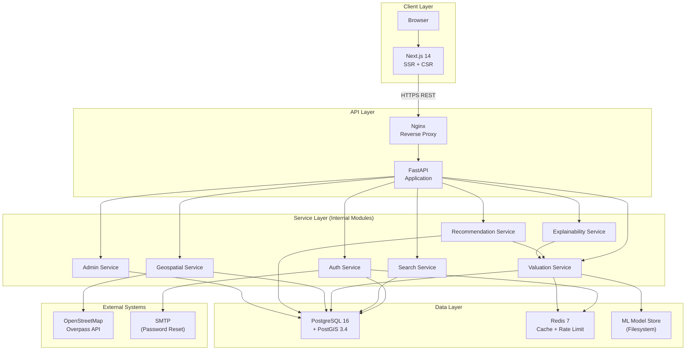
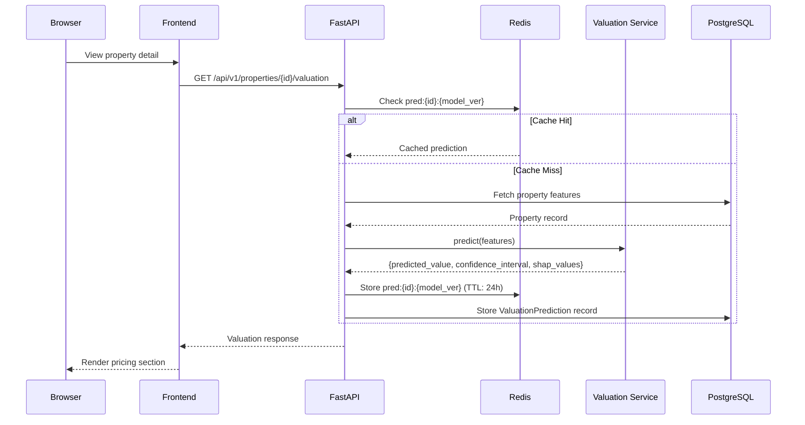
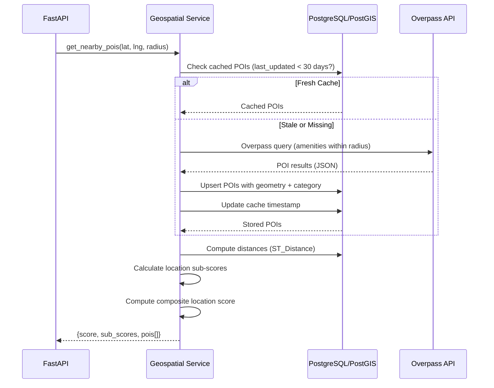

# 06 — System Architecture

## Overview

DataSage follows a **modular monolith** architecture for the MVP, with clearly defined service boundaries that can be extracted into microservices if scaling demands it. This section documents the system-level architecture, technology rationale, component interactions, and deployment topology.

---

## Architectural Style: Modular Monolith

### What
A single deployable backend application (FastAPI) with internal module boundaries enforced by directory structure and dependency rules. The frontend is a separate Next.js application that communicates with the backend via REST API.

### Why (Over Alternatives)

| Alternative | Why Not (for MVP) |
|-------------|-------------------|
| Microservices | Premature for a team of 1–3. Adds operational complexity (service discovery, distributed tracing, eventual consistency) without proportional benefit at MVP scale. |
| Serverless (Lambda/Cloud Functions) | Cold-start latency problematic for ML inference. Harder to manage stateful ML model loading. Vendor lock-in. |
| Monolithic (no module boundaries) | No path to scaling. Tightly coupled code becomes unmaintainable. |
| Django | Sync-first framework. FastAPI's async support, automatic OpenAPI docs, and Pydantic integration are stronger for this use case. |

### Tradeoffs
- **Pro**: Simple deployment, single process, easy debugging, shared database transaction scope.
- **Con**: All modules share one process — a memory leak in the ML module affects the entire app. Mitigated by isolating heavy ML workloads to async background tasks.

### Extraction Path
Each module (auth, search, valuation, geo, recommendations) is a separate Python package under `datasage/`. When a module needs to scale independently:
1. Extract the module package
2. Deploy it as a standalone FastAPI service
3. Replace in-process calls with HTTP/gRPC calls
4. Add a shared message queue for async work

---

## High-Level Architecture



---

## Component Catalog

### Frontend: Next.js 14

| Aspect | Decision | Rationale |
|--------|----------|-----------|
| Framework | Next.js 14 (App Router) | SSR for SEO on landing/property pages, CSR for interactive dashboards, file-based routing |
| Rendering | SSR for public pages, CSR for authenticated pages | SEO on property pages, fast interaction on dashboard |
| State management | React Context + SWR | Context for auth/preferences, SWR for data fetching with caching/revalidation |
| Maps | Leaflet + react-leaflet | Free, no API key limits, extensive plugin ecosystem |
| Styling | CSS Modules + CSS custom properties | Scoped styles, no build-time CSS framework dependency |
| HTTP client | fetch (native) wrapped in API client module | No additional dependency. SWR handles caching/revalidation. |

### Backend: FastAPI (Python 3.11+)

| Aspect | Decision | Rationale |
|--------|----------|-----------|
| Framework | FastAPI | Async-first, auto OpenAPI docs, Pydantic validation, native to ML ecosystem |
| ORM | SQLAlchemy 2.0 (async) | Mature, PostGIS support via GeoAlchemy2, async session support |
| Migrations | Alembic | Standard SQLAlchemy migration tool |
| Task queue | None (MVP) → Celery (future) | MVP uses background threads for light async work. Celery for heavy batch processing later. |
| Validation | Pydantic v2 | Request/response validation, serialization, settings management |
| ASGI server | Uvicorn | High-performance ASGI server, reload support in dev |

### Database: PostgreSQL 16 + PostGIS 3.4

| Aspect | Decision | Rationale |
|--------|----------|-----------|
| Engine | PostgreSQL 16 | Mature, ACID, excellent geospatial support, JSONB for flexible fields |
| Geospatial | PostGIS 3.4 | ST_Distance, ST_DWithin, GiST indexes for spatial queries |
| Connection pooling | asyncpg + SQLAlchemy async | Native async PostgreSQL driver, connection pool management |
| Backups | pg_dump (cron) → S3/local | Daily automated backups |

### Cache: Redis 7

| Use Case | Key Pattern | TTL |
|----------|-------------|-----|
| ML prediction cache | `pred:{property_id}:{model_version}` | 24 hours |
| Session/token blacklist | `token:blacklist:{jti}` | Token expiry |
| Rate limiting | `ratelimit:{user_id}:{endpoint}` | 1 minute window |
| POI query cache | `poi:{lat_bucket}:{lng_bucket}:{radius}` | 30 days |
| API response cache | `api:{endpoint}:{query_hash}` | 1 hour |

### ML Model Store

| Aspect | Decision | Rationale |
|--------|----------|-----------|
| Model format | joblib serialization | Standard for scikit-learn/XGBoost. Fast load times. |
| Storage | Filesystem (mounted volume) | Simple for MVP. S3 for production. |
| Loading | On application startup | Model loaded into memory once. Reloaded on model version change signal. |
| Versioning | Directory per version: `models/v1/`, `models/v2/` | Admin selects active version via config. |

---

## Communication Patterns

### Frontend → Backend
- **Protocol**: HTTPS REST (JSON)
- **Authentication**: JWT Bearer token in `Authorization` header
- **Error format**: Standardized JSON error response (see [21 — Error Handling](21-error-handling.md))
- **Pagination**: Cursor-based for list endpoints

### Backend → Database
- **Protocol**: PostgreSQL wire protocol (asyncpg)
- **Connection pool**: SQLAlchemy async session, pool_size=10, max_overflow=20
- **Transactions**: Per-request transaction scope (FastAPI dependency)

### Backend → Redis
- **Protocol**: Redis protocol (aioredis via redis-py async)
- **Pattern**: Cache-aside (check cache → if miss, compute → store in cache)

### Backend → OpenStreetMap
- **Protocol**: HTTPS (Overpass API)
- **Pattern**: Query → parse → cache in PostgreSQL
- **Rate limiting**: Max 2 requests/second to Overpass API (self-imposed)
- **Fallback**: If Overpass is unreachable, serve from PostgreSQL cache

---

## Data Flow: Property Valuation



---

## Data Flow: Geospatial POI Query



---

## Security Architecture

Detailed in [19 — Security](19-security.md). Key architectural decisions:

- **Network**: Nginx terminates TLS. Backend runs on internal network only.
- **Authentication**: JWT tokens (access: 30 min, refresh: 7 days). Refresh token rotation.
- **Authorization**: RBAC with 4 roles. Endpoint-level permission decorators.
- **Secrets**: Environment variables (never in code). `.env` files gitignored.
- **Input validation**: Pydantic models validate all API inputs. SQL injection prevented by ORM.
- **Rate limiting**: Redis-backed sliding window rate limiter.

---

## Deployment Topology

### Development (Local)

```
┌──────────────────────────────────────────┐
│ Docker Compose                           │
│                                          │
│  ┌──────────┐  ┌──────────┐  ┌────────┐ │
│  │ Frontend │  │ Backend  │  │  Nginx │ │
│  │ :3000    │  │ :8000    │  │  :80   │ │
│  └──────────┘  └──────────┘  └────────┘ │
│                                          │
│  ┌──────────┐  ┌──────────┐             │
│  │ Postgres │  │  Redis   │             │
│  │ :5432    │  │  :6379   │             │
│  └──────────┘  └──────────┘             │
└──────────────────────────────────────────┘
```

### Production (Future)

```
┌─────────────────────────────────────────────────────┐
│ Cloud Provider (AWS/GCP/Azure)                      │
│                                                     │
│  CDN ──→ Frontend (Vercel/Container)                │
│                                                     │
│  Load Balancer ──→ Backend (N containers)           │
│                                                     │
│  Managed PostgreSQL (RDS/Cloud SQL) + PostGIS       │
│                                                     │
│  Managed Redis (ElastiCache/Memorystore)            │
│                                                     │
│  ML Model Store (S3/GCS)                            │
│                                                     │
│  Monitoring (Prometheus + Grafana / CloudWatch)     │
└─────────────────────────────────────────────────────┘
```

---

## Technology Decision Records

### TDR-001: FastAPI over Django REST Framework

| Aspect | FastAPI | Django REST |
|--------|---------|-------------|
| Async support | Native (ASGI) | Partial (Django 4.1+, but DRF is sync) |
| Auto API docs | Built-in (Swagger + ReDoc) | Requires drf-spectacular |
| Validation | Pydantic (fast, type-safe) | Serializers (verbose) |
| ML ecosystem | Native Python — seamless | Same, but sync overhead |
| Learning curve | Moderate | Lower (more tutorials) |
| **Decision** | **FastAPI** | |
| **Reason** | Async performance matters for concurrent ML predictions + geo queries. Pydantic aligns with ML data validation patterns. Auto-docs reduce API documentation burden. |

### TDR-002: PostgreSQL + PostGIS over MongoDB

| Aspect | PostgreSQL + PostGIS | MongoDB |
|--------|---------------------|---------|
| Geospatial | PostGIS — full GIS suite, spatial indexes, topology | 2dsphere indexes — basic spatial queries |
| ACID transactions | Full | Multi-document transactions (4.0+, with caveats) |
| Schema enforcement | Strong | Flexible (can be a liability for data quality) |
| Relationships | Foreign keys, joins | Manual reference resolution |
| Analytics queries | Excellent (window functions, CTEs) | Aggregation pipeline (less intuitive) |
| **Decision** | **PostgreSQL + PostGIS** | |
| **Reason** | Real estate data is inherently relational (property → location → amenities → valuations). PostGIS provides production-grade geospatial queries. Schema enforcement catches data quality issues early. |

### TDR-003: Leaflet over Google Maps / Mapbox

| Aspect | Leaflet + OSM | Google Maps | Mapbox |
|--------|--------------|-------------|--------|
| Cost | Free | $7/1000 loads (after free tier) | Free tier + usage-based |
| API key required | No | Yes | Yes |
| Tile source | OpenStreetMap (free, open) | Google (proprietary) | Mapbox (proprietary) |
| Customization | Extensive (plugins) | Limited | Extensive |
| Data source alignment | OSM data + OSM tiles = consistent | Mismatch with OSM POI data | Mismatch |
| **Decision** | **Leaflet + OSM** | | |
| **Reason** | DataSage already uses OSM for POI data. Using OSM tiles ensures visual consistency. No API key management, no usage-based costs, no vendor lock-in. |

### TDR-004: SWR over Redux / React Query

| Aspect | SWR | Redux Toolkit + RTK Query | React Query (TanStack) |
|--------|-----|--------------------------|----------------------|
| Bundle size | ~4 KB | ~30 KB | ~12 KB |
| Complexity | Low | High (actions, reducers, slices) | Moderate |
| Caching | Built-in with stale-while-revalidate | Manual cache management | Built-in |
| SSR support | Yes (Next.js native) | Yes | Yes |
| Global state | No (use React Context) | Yes | No |
| **Decision** | **SWR + React Context** | | |
| **Reason** | DataSage's frontend state is primarily server-derived (properties, valuations, recommendations). SWR's stale-while-revalidate pattern is ideal. Auth/preference state is small and well-served by React Context. Redux is overkill. |

---

## Related Documents

- [07 — Frontend Architecture](07-frontend-architecture.md)
- [08 — Backend Architecture](08-backend-architecture.md)
- [09 — Database Design](09-database-design.md)
- [10 — API Specification](10-api-specification.md)
- [24 — Deployment](24-deployment.md)
