# 08 — Backend Architecture

## Overview

The DataSage backend is a FastAPI application following a layered architecture with clear separation between API routing, business logic, data access, and external integrations.

---

## Layered Architecture

```mermaid
graph TB
    subgraph API["API Layer (Routers)"]
        R1["auth router"]
        R2["properties router"]
        R3["valuation router"]
        R4["geo router"]
        R5["recommendations router"]
        R6["comparison router"]
        R7["admin router"]
    end

    subgraph SVC["Service Layer (Business Logic)"]
        S1["AuthService"]
        S2["PropertyService"]
        S3["ValuationService"]
        S4["GeoService"]
        S5["RecommendationService"]
        S6["ComparisonService"]
        S7["AdminService"]
        S8["ExplainabilityService"]
    end

    subgraph REPO["Repository Layer (Data Access)"]
        D1["UserRepository"]
        D2["PropertyRepository"]
        D3["ValuationRepository"]
        D4["POIRepository"]
        D5["PreferenceRepository"]
        D6["DatasetRepository"]
    end

    subgraph EXT["External Layer"]
        E1["OverpassClient"]
        E2["EmailClient"]
        E3["MLModelLoader"]
    end

    R1 --> S1
    R2 --> S2
    R3 --> S3
    R4 --> S4
    R5 --> S5
    R6 --> S6
    R7 --> S7
    S3 --> S8

    S1 --> D1
    S2 --> D2
    S3 --> D2
    S3 --> D3
    S4 --> D4
    S4 --> E1
    S5 --> D2
    S5 --> D5
    S7 --> D6
    S1 --> E2
    S3 --> E3
```



### Layer Rules

| Layer | Responsibility | Can Depend On | Cannot Depend On |
|-------|---------------|---------------|------------------|
| **API (Routers)** | HTTP request/response, validation, auth guards | Service layer | Repository, External, Models |
| **Service** | Business logic, orchestration, validation | Repository, External, other Services | Routers |
| **Repository** | Database queries, ORM operations | SQLAlchemy models | Services, Routers, External |
| **External** | Third-party API clients (OSM, email) | Nothing internal | Everything internal |
| **Models** | SQLAlchemy ORM model definitions | Nothing | Everything |
| **Schemas** | Pydantic request/response schemas | Nothing | Everything |

---

## Directory Structure

```
backend/
├── datasage/
│   ├── __init__.py
│   ├── main.py                    # FastAPI app factory, middleware, startup
│   ├── core/
│   │   ├── __init__.py
│   │   ├── config.py              # Pydantic Settings (env vars)
│   │   ├── security.py            # JWT creation/verification, password hashing
│   │   ├── dependencies.py        # FastAPI dependency injection
│   │   ├── exceptions.py          # Custom exception classes
│   │   ├── middleware.py          # Request ID, CORS, logging middleware
│   │   └── database.py           # Async engine, session factory
│   ├── api/
│   │   ├── __init__.py
│   │   ├── v1/
│   │   │   ├── __init__.py
│   │   │   ├── router.py         # Aggregates all v1 routers
│   │   │   ├── auth.py           # POST /auth/register, /auth/login, etc.
│   │   │   ├── properties.py     # GET /properties, /properties/{id}
│   │   │   ├── valuation.py      # GET /properties/{id}/valuation
│   │   │   ├── geo.py            # GET /properties/{id}/location
│   │   │   ├── recommendations.py # GET /recommendations
│   │   │   ├── comparison.py     # POST /comparison
│   │   │   ├── saved.py          # GET/POST/DELETE /saved-properties
│   │   │   ├── search_history.py # GET/DELETE /search-history
│   │   │   └── admin/
│   │   │       ├── __init__.py
│   │   │       ├── datasets.py
│   │   │       ├── models.py
│   │   │       ├── users.py
│   │   │       └── audit.py
│   │   └── deps.py               # API-level dependencies (get_current_user, etc.)
│   ├── models/
│   │   ├── __init__.py
│   │   ├── base.py               # Base model with id, timestamps, soft delete
│   │   ├── user.py               # User, UserPreference
│   │   ├── property.py           # Property, PropertyImage, PropertyFeature
│   │   ├── location.py           # PropertyLocation, POI, LocationScore
│   │   ├── valuation.py          # ValuationPrediction, ModelVersion
│   │   ├── recommendation.py     # Recommendation, RecommendationReason
│   │   ├── interaction.py        # SavedProperty, SearchHistory
│   │   ├── admin.py              # Dataset, DatasetImport, DataQualityReport
│   │   └── audit.py              # AuditLog
│   ├── schemas/
│   │   ├── __init__.py
│   │   ├── auth.py               # LoginRequest, TokenResponse, RegisterRequest
│   │   ├── user.py               # UserResponse, UserPreferenceRequest
│   │   ├── property.py           # PropertyResponse, PropertySearchParams
│   │   ├── valuation.py          # ValuationResponse, PricingClassification
│   │   ├── geo.py                # LocationScoreResponse, POIResponse
│   │   ├── recommendation.py     # RecommendationResponse
│   │   ├── comparison.py         # ComparisonRequest, ComparisonResponse
│   │   ├── admin.py              # DatasetResponse, ModelVersionResponse
│   │   └── common.py             # PaginatedResponse, ErrorResponse
│   ├── services/
│   │   ├── __init__.py
│   │   ├── auth_service.py
│   │   ├── property_service.py
│   │   ├── valuation_service.py
│   │   ├── geo_service.py
│   │   ├── recommendation_service.py
│   │   ├── comparison_service.py
│   │   ├── explainability_service.py
│   │   ├── investment_service.py
│   │   └── admin_service.py
│   ├── repositories/
│   │   ├── __init__.py
│   │   ├── user_repo.py
│   │   ├── property_repo.py
│   │   ├── valuation_repo.py
│   │   ├── poi_repo.py
│   │   ├── preference_repo.py
│   │   └── dataset_repo.py
│   ├── ml/
│   │   ├── __init__.py
│   │   ├── model_loader.py       # Load serialized model from disk
│   │   ├── feature_builder.py    # Build feature vector from property data
│   │   ├── predictor.py          # Run inference, compute confidence interval
│   │   └── shap_explainer.py     # SHAP value computation
│   ├── geo/
│   │   ├── __init__.py
│   │   ├── overpass_client.py    # Overpass API client
│   │   ├── poi_processor.py      # Parse OSM responses, categorize POIs
│   │   └── scoring.py            # Location score computation
│   └── cli/
│       ├── __init__.py
│       └── seed.py               # CLI commands for seeding demo data
├── migrations/
│   ├── env.py
│   ├── alembic.ini
│   └── versions/                 # Alembic migration files
├── tests/
│   ├── conftest.py               # Test fixtures (test DB, test client, factories)
│   ├── unit/
│   │   ├── test_valuation_service.py
│   │   ├── test_geo_scoring.py
│   │   └── test_recommendation_service.py
│   ├── integration/
│   │   ├── test_auth_api.py
│   │   ├── test_properties_api.py
│   │   └── test_valuation_api.py
│   └── factories/
│       ├── user_factory.py
│       └── property_factory.py
├── pyproject.toml
└── requirements.txt
```

---

## Application Factory

```python
# datasage/main.py
from fastapi import FastAPI
from datasage.core.config import settings
from datasage.core.middleware import add_middleware
from datasage.core.database import init_db
from datasage.ml.model_loader import load_model
from datasage.api.v1.router import api_v1_router

def create_app() -> FastAPI:
    app = FastAPI(
        title="DataSage API",
        version=settings.APP_VERSION,
        docs_url="/docs" if settings.APP_DEBUG else None,
        redoc_url="/redoc" if settings.APP_DEBUG else None,
    )

    add_middleware(app)
    app.include_router(api_v1_router, prefix="/api/v1")

    @app.on_event("startup")
    async def startup():
        await init_db()
        load_model(settings.ML_MODEL_DIR, settings.ML_VALUATION_MODEL_NAME)

    @app.get("/health")
    async def health():
        return {"status": "ok", "version": settings.APP_VERSION}

    return app

app = create_app()
```

---

## Dependency Injection

FastAPI's `Depends()` system is used for cross-cutting concerns:

```python
# datasage/api/deps.py
from fastapi import Depends, HTTPException, status
from fastapi.security import HTTPBearer, HTTPAuthorizationCredentials
from datasage.core.security import verify_token
from datasage.core.database import get_session
from datasage.repositories.user_repo import UserRepository

security = HTTPBearer()

async def get_current_user(
    credentials: HTTPAuthorizationCredentials = Depends(security),
    session = Depends(get_session),
):
    payload = verify_token(credentials.credentials)
    if not payload:
        raise HTTPException(status_code=401, detail="Invalid token")
    user_repo = UserRepository(session)
    user = await user_repo.get_by_id(payload["sub"])
    if not user or not user.is_active:
        raise HTTPException(status_code=401, detail="User not found or inactive")
    return user

def require_role(*roles: str):
    async def role_checker(user = Depends(get_current_user)):
        if user.role not in roles:
            raise HTTPException(status_code=403, detail="Insufficient permissions")
        return user
    return role_checker
```

### Dependency Graph

```
Router endpoint
  ├── Depends(get_current_user)         → Auth check
  │     ├── Depends(HTTPBearer)          → Extract token
  │     └── Depends(get_session)         → DB session
  ├── Depends(get_session)               → DB session (if separate)
  └── Service (instantiated with session)
        └── Repository (instantiated with session)
```

---

## Database Session Management

One async session per request, with automatic commit/rollback:

```python
# datasage/core/database.py
from sqlalchemy.ext.asyncio import create_async_engine, AsyncSession
from sqlalchemy.orm import sessionmaker

engine = create_async_engine(
    settings.DATABASE_URL,
    pool_size=settings.POSTGRES_POOL_SIZE,
    max_overflow=settings.POSTGRES_MAX_OVERFLOW,
    echo=settings.APP_DEBUG,
)

async_session = sessionmaker(engine, class_=AsyncSession, expire_on_commit=False)

async def get_session():
    async with async_session() as session:
        try:
            yield session
            await session.commit()
        except Exception:
            await session.rollback()
            raise
```

---

## Configuration Management

Pydantic Settings for type-safe environment variable parsing:

```python
# datasage/core/config.py
from pydantic_settings import BaseSettings

class Settings(BaseSettings):
    # Application
    APP_NAME: str = "DataSage"
    APP_ENV: str = "development"
    APP_DEBUG: bool = True
    APP_VERSION: str = "0.1.0"
    APP_HOST: str = "0.0.0.0"
    APP_PORT: int = 8000

    # Database
    POSTGRES_HOST: str = "localhost"
    POSTGRES_PORT: int = 5432
    POSTGRES_DB: str = "datasage"
    POSTGRES_USER: str = "datasage"
    POSTGRES_PASSWORD: str
    POSTGRES_POOL_SIZE: int = 10
    POSTGRES_MAX_OVERFLOW: int = 20

    @property
    def DATABASE_URL(self) -> str:
        return (
            f"postgresql+asyncpg://{self.POSTGRES_USER}:{self.POSTGRES_PASSWORD}"
            f"@{self.POSTGRES_HOST}:{self.POSTGRES_PORT}/{self.POSTGRES_DB}"
        )

    # JWT
    JWT_SECRET_KEY: str
    JWT_ALGORITHM: str = "HS256"
    JWT_ACCESS_TOKEN_EXPIRE_MINUTES: int = 30
    JWT_REFRESH_TOKEN_EXPIRE_DAYS: int = 7

    # Redis
    REDIS_HOST: str = "localhost"
    REDIS_PORT: int = 6379

    # ML
    ML_MODEL_DIR: str = "./ml/models"
    ML_VALUATION_MODEL_NAME: str = "valuation_xgb_v1.joblib"
    ML_PREDICTION_CACHE_TTL: int = 86400

    # Geospatial
    OVERPASS_API_URL: str = "https://overpass-api.de/api/interpreter"
    GEO_SEARCH_RADIUS_METERS: int = 5000

    class Config:
        env_file = ".env"
        case_sensitive = True

settings = Settings()
```

---

## Error Handling

All exceptions flow through a centralized error handler:

```python
# datasage/core/exceptions.py
class DataSageError(Exception):
    """Base exception for all DataSage errors."""
    def __init__(self, message: str, code: str, status_code: int = 500):
        self.message = message
        self.code = code
        self.status_code = status_code

class NotFoundError(DataSageError):
    def __init__(self, resource: str, identifier: str):
        super().__init__(
            message=f"{resource} with ID '{identifier}' not found",
            code="NOT_FOUND",
            status_code=404,
        )

class ValidationError(DataSageError):
    def __init__(self, message: str, field: str = None):
        super().__init__(message=message, code="VALIDATION_ERROR", status_code=422)
        self.field = field

class InsufficientDataError(DataSageError):
    def __init__(self, missing_fields: list[str]):
        super().__init__(
            message=f"Insufficient data for prediction. Missing: {', '.join(missing_fields)}",
            code="INSUFFICIENT_DATA",
            status_code=422,
        )

class ModelNotLoadedError(DataSageError):
    def __init__(self):
        super().__init__(
            message="ML model is not loaded. AI analysis is temporarily unavailable.",
            code="MODEL_NOT_LOADED",
            status_code=503,
        )
```

### Global Exception Handler

```python
# In main.py
from fastapi.responses import JSONResponse

@app.exception_handler(DataSageError)
async def datasage_error_handler(request, exc: DataSageError):
    return JSONResponse(
        status_code=exc.status_code,
        content={
            "error": {
                "code": exc.code,
                "message": exc.message,
                "request_id": request.state.request_id,
            }
        },
    )
```

---

## Middleware Stack

Applied in this order (outermost first):

| Order | Middleware | Purpose |
|-------|-----------|---------|
| 1 | RequestID | Attach unique request_id to every request |
| 2 | CORS | Allow frontend origin |
| 3 | RateLimiter | Per-user, per-endpoint rate limiting |
| 4 | RequestLogger | Log request/response (method, path, status, duration) |
| 5 | ErrorHandler | Catch unhandled exceptions, return structured error |

---

## Async Strategy

| Operation | Sync/Async | Rationale |
|-----------|-----------|-----------|
| DB queries | Async (asyncpg) | Non-blocking I/O for concurrent requests |
| Redis operations | Async (aioredis) | Non-blocking I/O |
| Overpass API calls | Async (httpx) | Non-blocking HTTP |
| ML model inference | Sync (run in thread pool) | CPU-bound; scikit-learn/XGBoost are not async. Use `asyncio.to_thread()` |
| Password hashing | Sync (run in thread pool) | CPU-bound bcrypt. Use `asyncio.to_thread()` |
| File I/O (dataset upload) | Async (aiofiles) | Non-blocking file reads |

```python
# Example: Running sync ML inference in async context
import asyncio

async def get_valuation(self, property_id: str):
    features = await self.build_features(property_id)
    # Run CPU-bound ML inference in thread pool
    prediction = await asyncio.to_thread(
        self.model.predict, features
    )
    return prediction
```

---

## Background Tasks

### MVP: FastAPI BackgroundTasks

For lightweight operations that don't need guaranteed delivery:

```python
from fastapi import BackgroundTasks

@router.post("/auth/register")
async def register(body: RegisterRequest, bg: BackgroundTasks):
    user = await auth_service.register(body)
    bg.add_task(send_welcome_email, user.email)
    return user
```

### Future: Celery + Redis

For heavy operations requiring guaranteed delivery, retries, and monitoring:
- Batch ML predictions
- Dataset import processing
- OSM data refresh jobs
- Email notifications

---

## API Versioning

All API endpoints are prefixed with `/api/v1/`. When breaking changes are needed:

1. Create a new router module under `api/v2/`
2. Mount it alongside v1: `app.include_router(api_v2_router, prefix="/api/v2")`
3. Deprecate v1 endpoints with a `Deprecation` response header
4. Remove v1 after migration period (6 months minimum)

---

## Caching Strategy

| Data | Cache Layer | TTL | Invalidation |
|------|------------|-----|-------------|
| ML predictions | Redis | 24 hours | Property data change |
| POI query results | PostgreSQL | 30 days | Scheduled re-query |
| Location scores | PostgreSQL | On POI refresh | POI update trigger |
| API response (search) | Redis | 1 hour | New property data import |
| User session data | Redis | 30 min (access) / 7 days (refresh) | Logout / token refresh |
| Locality autocomplete | Redis | 7 days | Locality list update |

---

## Related Documents

- [06 — System Architecture](06-system-architecture.md)
- [09 — Database Design](09-database-design.md)
- [10 — API Specification](10-api-specification.md)
- [12 — ML System Design](12-ml-system-design.md)
- [21 — Error Handling](21-error-handling.md)
