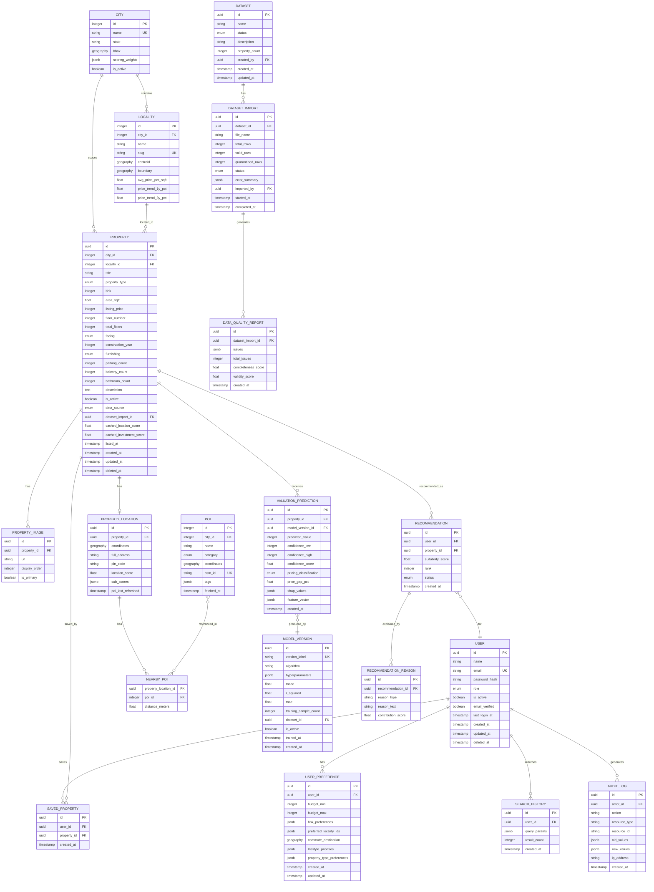

# 09 — Database Design

## Overview

DataSage uses PostgreSQL 16 with PostGIS 3.4 for geospatial queries. This document defines the complete schema: tables, columns, types, constraints, indexes, relationships, and geospatial columns.

---

## Design Principles

1. **Normalized to 3NF** with strategic denormalization for read-heavy queries (e.g., `location_score` cached on the property record).
2. **Soft deletion** via `deleted_at` timestamp. Queries filter `WHERE deleted_at IS NULL` by default.
3. **Audit timestamps** on every table: `created_at`, `updated_at`.
4. **UUID primary keys** for all user-facing entities (avoids sequential ID enumeration).
5. **City-scoped data** via `city_id` for multi-city expansion without schema changes.
6. **PostGIS geography columns** for accurate distance calculations on the WGS 84 ellipsoid.

---

## Entity Relationship Diagram



---

## Table Details

### `user`

| Column | Type | Constraints | Notes |
|--------|------|-------------|-------|
| id | UUID | PK, default gen_random_uuid() | |
| name | VARCHAR(100) | NOT NULL | |
| email | VARCHAR(255) | NOT NULL, UNIQUE | Lowercase, trimmed |
| password_hash | VARCHAR(255) | NOT NULL | bcrypt hash |
| role | VARCHAR(20) | NOT NULL, CHECK IN ('buyer','investor','professional','admin') | Default: 'buyer' |
| is_active | BOOLEAN | NOT NULL, DEFAULT true | Soft deactivation flag |
| email_verified | BOOLEAN | NOT NULL, DEFAULT false | |
| last_login_at | TIMESTAMPTZ | | |
| created_at | TIMESTAMPTZ | NOT NULL, DEFAULT now() | |
| updated_at | TIMESTAMPTZ | NOT NULL, DEFAULT now() | Auto-updated via trigger |
| deleted_at | TIMESTAMPTZ | | Soft delete |

**Indexes:**
- `idx_user_email` — UNIQUE on `email` WHERE `deleted_at IS NULL`
- `idx_user_role` — BTREE on `role`

### `property`

| Column | Type | Constraints | Notes |
|--------|------|-------------|-------|
| id | UUID | PK | |
| city_id | INTEGER | FK → city(id), NOT NULL | Partitioning key for future |
| locality_id | INTEGER | FK → locality(id), NOT NULL | |
| title | VARCHAR(255) | NOT NULL | Auto-generated or user-provided |
| property_type | VARCHAR(20) | NOT NULL, CHECK IN ('apartment','builder_floor','house','plot') | |
| bhk | SMALLINT | NOT NULL, CHECK > 0 | |
| area_sqft | REAL | NOT NULL, CHECK > 0 | |
| listing_price | INTEGER | NOT NULL, CHECK > 0 | INR, whole rupees |
| floor_number | SMALLINT | | NULL = unknown |
| total_floors | SMALLINT | | |
| facing | VARCHAR(20) | CHECK IN ('north','south','east','west','north_east','north_west','south_east','south_west') | |
| construction_year | SMALLINT | CHECK BETWEEN 1950 AND extract(year from now()) + 5 | |
| furnishing | VARCHAR(20) | CHECK IN ('unfurnished','semi_furnished','fully_furnished') | |
| parking_count | SMALLINT | DEFAULT 0 | |
| balcony_count | SMALLINT | DEFAULT 0 | |
| bathroom_count | SMALLINT | | |
| description | TEXT | | |
| is_active | BOOLEAN | NOT NULL, DEFAULT true | |
| data_source | VARCHAR(30) | NOT NULL, CHECK IN ('seed','government','manual','import') | Data provenance |
| dataset_import_id | UUID | FK → dataset_import(id) | Which import created this |
| cached_location_score | REAL | | Denormalized for sort/filter |
| cached_investment_score | REAL | | Denormalized for sort/filter |
| listed_at | TIMESTAMPTZ | | When the listing appeared |
| created_at | TIMESTAMPTZ | NOT NULL, DEFAULT now() | |
| updated_at | TIMESTAMPTZ | NOT NULL, DEFAULT now() | |
| deleted_at | TIMESTAMPTZ | | |

**Indexes:**
- `idx_property_city_locality` — BTREE on `(city_id, locality_id)` WHERE `deleted_at IS NULL AND is_active = true`
- `idx_property_listing_price` — BTREE on `listing_price`
- `idx_property_bhk` — BTREE on `bhk`
- `idx_property_type` — BTREE on `property_type`
- `idx_property_search` — Composite on `(city_id, locality_id, bhk, property_type, listing_price)` for search queries

### `property_location`

| Column | Type | Constraints | Notes |
|--------|------|-------------|-------|
| id | UUID | PK | |
| property_id | UUID | FK → property(id), UNIQUE, NOT NULL | 1:1 relationship |
| coordinates | GEOGRAPHY(POINT, 4326) | NOT NULL | PostGIS geography for accurate distance |
| full_address | TEXT | | |
| pin_code | VARCHAR(10) | | Indian PIN code |
| location_score | REAL | CHECK BETWEEN 0 AND 100 | Composite score |
| sub_scores | JSONB | | `{"transit": 85, "schools": 70, ...}` |
| poi_last_refreshed | TIMESTAMPTZ | | When POIs were last queried from OSM |

**Indexes:**
- `idx_property_location_coords` — GIST on `coordinates` (spatial index)
- `idx_property_location_score` — BTREE on `location_score`

### `poi` (Points of Interest)

| Column | Type | Constraints | Notes |
|--------|------|-------------|-------|
| id | SERIAL | PK | Integer for performance (millions of rows) |
| city_id | INTEGER | FK → city(id), NOT NULL | |
| name | VARCHAR(255) | | May be null for unnamed OSM nodes |
| category | VARCHAR(30) | NOT NULL, CHECK IN ('school','hospital','metro','bus_stop','park','shopping','restaurant','bank') | |
| coordinates | GEOGRAPHY(POINT, 4326) | NOT NULL | |
| osm_id | VARCHAR(50) | UNIQUE | OpenStreetMap node/way ID |
| tags | JSONB | | Raw OSM tags for future use |
| fetched_at | TIMESTAMPTZ | NOT NULL | When fetched from Overpass |

**Indexes:**
- `idx_poi_coords` — GIST on `coordinates`
- `idx_poi_city_category` — BTREE on `(city_id, category)`
- `idx_poi_osm_id` — UNIQUE on `osm_id`

### `nearby_poi` (Junction Table)

| Column | Type | Constraints | Notes |
|--------|------|-------------|-------|
| property_location_id | UUID | FK → property_location(id), NOT NULL | |
| poi_id | INTEGER | FK → poi(id), NOT NULL | |
| distance_meters | REAL | NOT NULL | Precomputed ST_Distance |

**Primary Key:** `(property_location_id, poi_id)`
**Index:** `idx_nearby_poi_distance` — BTREE on `distance_meters`

### `valuation_prediction`

| Column | Type | Constraints | Notes |
|--------|------|-------------|-------|
| id | UUID | PK | |
| property_id | UUID | FK → property(id), NOT NULL | |
| model_version_id | UUID | FK → model_version(id), NOT NULL | |
| predicted_value | INTEGER | NOT NULL | INR |
| confidence_low | INTEGER | NOT NULL | Lower bound of 90% CI |
| confidence_high | INTEGER | NOT NULL | Upper bound of 90% CI |
| confidence_score | REAL | NOT NULL, CHECK BETWEEN 0 AND 1 | |
| pricing_classification | VARCHAR(20) | NOT NULL, CHECK IN ('overpriced','fair','underpriced') | |
| price_gap_pct | REAL | NOT NULL | `((listing - predicted) / predicted) * 100` |
| shap_values | JSONB | | Feature → contribution mapping |
| feature_vector | JSONB | | Input features used (for reproducibility) |
| created_at | TIMESTAMPTZ | NOT NULL, DEFAULT now() | |

**Indexes:**
- `idx_valuation_property` — BTREE on `property_id`
- `idx_valuation_property_model` — UNIQUE on `(property_id, model_version_id)` (one prediction per model version)

---

## Entity Necessity Analysis

| Entity | Included? | Rationale |
|--------|-----------|-----------|
| User | ✅ | Core — authentication, preferences, interactions |
| UserPreference | ✅ | Recommendations require structured preferences. 1:1 with User. |
| Property | ✅ | Core entity |
| PropertyImage | ✅ | Separate table — one-to-many, display ordering |
| PropertyLocation | ✅ | Separated from Property for spatial index performance. 1:1. |
| PropertyPriceHistory | ❌ **Deferred** | Would require historical data we don't have. The `Locality.price_trend_*` columns serve the investment analysis use case. Add when historical data is available. |
| PropertyFeature | ❌ **Merged into Property** | The original spec suggested a separate features table. Analysis: all structural features (BHK, area, floor, etc.) are universal to all property types. A separate EAV-style features table adds complexity without benefit. JSONB `extra_features` column on Property can handle rare edge cases. |
| Amenity / PropertyAmenity | ❌ **Replaced by POI + nearby_poi** | The POI table from OSM data serves the amenity role. No need for a separate Amenity entity. |
| POI | ✅ | OpenStreetMap points of interest. Shared across properties. |
| NearbyPOI | ✅ | Junction table with precomputed distance |
| LocationScore | ❌ **Merged into PropertyLocation** | Score and sub-scores are 1:1 with location. Separate table adds a join with no benefit. |
| ValuationPrediction | ✅ | Core — one per (property, model_version) |
| ModelVersion | ✅ | Track ML model versions |
| Recommendation | ✅ | Core — links users to recommended properties |
| RecommendationReason | ✅ | Explainability — multiple reasons per recommendation |
| SavedProperty | ✅ | Simple junction with timestamp |
| SearchHistory | ✅ | JSONB query params — flexible |
| Dataset | ✅ | Admin dataset management |
| DatasetImport | ✅ | Track individual import operations |
| DataQualityReport | ✅ | Quality reports per import |
| AuditLog | ✅ | Admin action audit trail |
| Notification | ❌ **Future** | Notifications module is tagged as Future scope. |

---

## Geospatial Design

### Column Types

DataSage uses `GEOGRAPHY` (not `GEOMETRY`) for coordinate columns because:

1. **Accurate distance**: `GEOGRAPHY` computes distances on the WGS 84 ellipsoid (meters), not on a flat plane (degrees). Critical for "find all schools within 2 km".
2. **No projection errors**: Delhi-NCR spans ~100 km. Planar distance calculations at this scale introduce ~0.3% error — acceptable, but unnecessary when PostGIS GEOGRAPHY handles it correctly.
3. **Index support**: GiST indexes work with GEOGRAPHY.

### Key Spatial Queries

```sql
-- Find all POIs within 5 km of a property
SELECT p.*, ST_Distance(p.coordinates, pl.coordinates) AS distance_m
FROM poi p, property_location pl
WHERE pl.property_id = :property_id
  AND ST_DWithin(p.coordinates, pl.coordinates, 5000)
ORDER BY distance_m;

-- Find all properties within a bounding box (map viewport)
SELECT p.*
FROM property p
JOIN property_location pl ON p.id = pl.property_id
WHERE ST_Within(
    pl.coordinates::geometry,
    ST_MakeEnvelope(:west, :south, :east, :north, 4326)
);
```

---

## Soft Deletion Strategy

- All user-facing entities (`user`, `property`, `recommendation`) have a `deleted_at` TIMESTAMPTZ column.
- Default queries include `WHERE deleted_at IS NULL`.
- SQLAlchemy model base class applies this filter automatically.
- Hard deletion is performed by a scheduled cleanup job after 90 days.
- Admin entities (`dataset`, `audit_log`) do NOT use soft deletion — they are kept permanently.

---

## Migration Strategy

- **Tool**: Alembic (with async support)
- **Auto-generation**: `alembic revision --autogenerate -m "description"`
- **Naming**: Timestamped: `2026_09_21_001_create_user_table.py`
- **Review**: All auto-generated migrations are reviewed before running.
- **Rollback**: Each migration has a `downgrade()` function.
- **Data migrations**: Separate from schema migrations (never in the same revision).
- **PostGIS**: First migration enables `CREATE EXTENSION IF NOT EXISTS postgis;`

---

## Related Documents

- [06 — System Architecture](06-system-architecture.md)
- [08 — Backend Architecture](08-backend-architecture.md)
- [10 — API Specification](10-api-specification.md)
- [14 — Geospatial System](14-geospatial-system.md)
