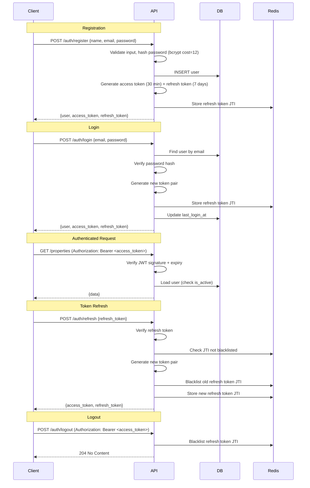
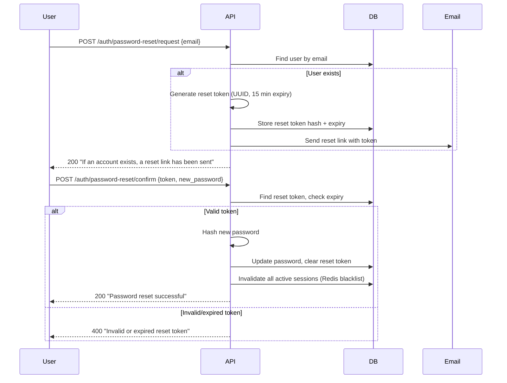

# 11 — Authentication & Authorization

## Overview

DataSage uses JWT-based authentication with refresh token rotation and role-based access control (RBAC) with four roles.

---

## Authentication Flow



---

## JWT Token Structure

### Access Token

```json
{
  "sub": "user-uuid",          // User ID
  "email": "priya@example.com",
  "role": "buyer",
  "type": "access",
  "iat": 1695300000,           // Issued at
  "exp": 1695301800,           // Expires: +30 min
  "jti": "token-uuid"          // Unique token ID
}
```

### Refresh Token

```json
{
  "sub": "user-uuid",
  "type": "refresh",
  "iat": 1695300000,
  "exp": 1695904800,           // Expires: +7 days
  "jti": "refresh-token-uuid"
}
```

### Token Configuration

| Parameter | Value | Rationale |
|-----------|-------|-----------|
| Algorithm | HS256 | Simple, fast. RS256 for multi-service JWT verification (future). |
| Access token TTL | 30 minutes | Short-lived to limit damage if stolen |
| Refresh token TTL | 7 days | Balances security with UX (no re-login for a week) |
| Refresh rotation | Enabled | Each refresh issues a new pair, old refresh token is blacklisted |
| Concurrent sessions | Max 5 per user | Oldest session invalidated when limit exceeded |

---

## Role-Based Access Control (RBAC)

### Roles

| Role | Description | Default? |
|------|-------------|----------|
| `buyer` | Home buyer. Full access to search, valuations, recommendations. | Yes (on registration) |
| `investor` | Property investor. Same as buyer + investment-focused defaults. | No (self-assigned or admin-assigned) |
| `professional` | Real estate professional. Same as buyer + future portfolio features. | No (admin-assigned) |
| `admin` | Platform administrator. Full access to admin dashboard, data management, user management. | No (seeded or admin-assigned) |

### Permission Matrix

| Endpoint Group | buyer | investor | professional | admin |
|---------------|:-----:|:--------:|:------------:|:-----:|
| Auth (own profile) | ✅ | ✅ | ✅ | ✅ |
| Property search/detail | ✅ | ✅ | ✅ | ✅ |
| Valuation/location/investment | ✅ | ✅ | ✅ | ✅ |
| Recommendations | ✅ | ✅ | ✅ | ✅ |
| Comparison | ✅ | ✅ | ✅ | ✅ |
| Saved properties | ✅ | ✅ | ✅ | ✅ |
| Search history | ✅ | ✅ | ✅ | ✅ |
| Preferences | ✅ | ✅ | ✅ | ✅ |
| Admin: dashboard | ❌ | ❌ | ❌ | ✅ |
| Admin: datasets | ❌ | ❌ | ❌ | ✅ |
| Admin: model management | ❌ | ❌ | ❌ | ✅ |
| Admin: user management | ❌ | ❌ | ❌ | ✅ |
| Admin: audit logs | ❌ | ❌ | ❌ | ✅ |

### Implementation

```python
# Usage in routers
from datasage.api.deps import require_role

@router.get("/admin/datasets")
async def list_datasets(
    user = Depends(require_role("admin")),
    session = Depends(get_session),
):
    # Only admin can access
    ...

@router.get("/properties")
async def search_properties(
    user = Depends(get_current_user_optional),  # None if unauthenticated
    session = Depends(get_session),
):
    # Accessible to everyone; auth optional for extra features
    ...
```

---

## Password Security

| Aspect | Implementation |
|--------|---------------|
| Hashing | bcrypt with cost factor 12 |
| Salt | Auto-generated per-password by bcrypt |
| Minimum length | 8 characters |
| Complexity | ≥1 uppercase, ≥1 digit |
| Common password check | Reject top 10,000 common passwords |
| Timing attacks | Constant-time comparison via `passlib` |
| Storage | Only hash stored; plaintext never logged or persisted |

---

## Account Lockout

| Trigger | Action | Resolution |
|---------|--------|-----------|
| 5 consecutive failed logins | Account locked for 15 minutes | Wait, or use password reset |
| 10 consecutive failed logins | Account locked until admin unlock | Contact admin or password reset |
| Failed login attempts | Increment counter in Redis (`login_attempts:{email}`, TTL: 15 min) | Counter resets on successful login or TTL expiry |

---

## Session Management

- **Stateless**: JWTs are self-contained. No server-side session store for access tokens.
- **Refresh tokens**: Tracked by JTI in Redis for blacklisting.
- **Concurrent sessions**: Redis set `sessions:{user_id}` tracks active refresh token JTIs. Max 5.
- **Logout**: Blacklists the refresh token JTI. Client discards access token.
- **Token refresh**: Old refresh token is immediately blacklisted (rotation prevents replay).

---

## Password Reset Flow



> **Security**: The response to `/password-reset/request` is always 200 regardless of whether the email exists. This prevents email enumeration attacks.

---

## Frontend Token Management

```typescript
// lib/auth.ts
const ACCESS_TOKEN_KEY = 'datasage_access_token';
const REFRESH_TOKEN_KEY = 'datasage_refresh_token';

// Tokens stored in memory (access) and httpOnly cookie (refresh, future)
// MVP: Both in localStorage (acceptable for development; move to httpOnly cookies for production)
export function setTokens(access: string, refresh: string) {
  localStorage.setItem(ACCESS_TOKEN_KEY, access);
  localStorage.setItem(REFRESH_TOKEN_KEY, refresh);
}

export function getAccessToken(): string | null {
  return localStorage.getItem(ACCESS_TOKEN_KEY);
}

export function clearTokens() {
  localStorage.removeItem(ACCESS_TOKEN_KEY);
  localStorage.removeItem(REFRESH_TOKEN_KEY);
}
```

> **Security Note**: For production, refresh tokens should be stored in httpOnly, Secure, SameSite=Strict cookies. The MVP uses localStorage for simplicity, with a clear TODO for migration.

---

## Related Documents

- [08 — Backend Architecture](08-backend-architecture.md)
- [10 — API Specification](10-api-specification.md)
- [19 — Security](19-security.md)
- [20 — Privacy](20-privacy.md)
