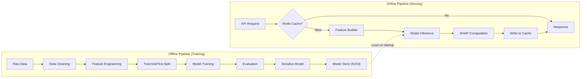

# 12 — ML System Design

## Overview

DataSage uses a gradient-boosted regression model (XGBoost) for property valuation and a classification overlay for over/underpricing detection. This document covers the ML pipeline architecture, model selection rationale, training/serving split, versioning, and retraining strategy.

---

## ML Pipeline Architecture



---

## Model Selection

### Problem Type
- **Primary**: Regression — predict property price (INR) from features
- **Secondary**: Classification — categorize as overpriced/fair/underpriced (derived from regression output)

### Algorithm: XGBoost Regressor

| Consideration | XGBoost | Linear Regression | Random Forest | Neural Network |
|--------------|---------|-------------------|---------------|---------------|
| Accuracy on tabular data | Excellent | Moderate | Good | Good (needs much more data) |
| Training speed | Fast | Very fast | Fast | Slow |
| Inference speed | Fast (~1ms) | Very fast | Moderate | Moderate |
| Interpretability (SHAP) | Excellent (TreeSHAP is exact, fast) | Native (coefficients) | Good | Poor (KernelSHAP is slow) |
| Handles missing values | Built-in | Requires imputation | Requires imputation | Requires imputation |
| Feature importance | Built-in + SHAP | Coefficients | Built-in | Requires SHAP |
| Non-linear relationships | Yes | No | Yes | Yes |
| Overfitting control | Regularization, early stopping | Limited | Bagging | Dropout, weight decay |
| Data requirements | Works with <50K samples | Works with small data | Works with <50K | Needs >100K typically |

**Decision**: XGBoost. Best accuracy-to-interpretability ratio for tabular data with <50K samples. TreeSHAP provides exact, fast explanations — critical for the Explainable AI requirement.

**Alternatives considered and rejected**:
- **LightGBM**: Comparable to XGBoost. Slightly faster training, but XGBoost has better SHAP integration and wider ecosystem support.
- **CatBoost**: Good with categorical features, but adds another dependency. XGBoost + manual encoding is sufficient.
- **Neural networks**: Inappropriate at our data scale. Would require >100K samples for competitive accuracy and makes SHAP computation expensive.

---

## Training Pipeline

### Data Split Strategy

| Split | Proportion | Purpose | Selection Method |
|-------|-----------|---------|-----------------|
| Training | 70% | Model fitting | Random with stratification by locality |
| Validation | 15% | Hyperparameter tuning, early stopping | Random |
| Test | 15% | Final evaluation (reported metrics) | Random, held out until final evaluation |

**Stratification**: Split is stratified by locality to ensure each locality is represented in all splits. Without this, the model might train on Gurgaon data and test on Noida data, biasing evaluation.

### Hyperparameter Tuning

| Parameter | Search Range | Method |
|-----------|-------------|--------|
| n_estimators | 100–1000 | Early stopping (no need to tune directly) |
| max_depth | 3–10 | Bayesian optimization (Optuna) |
| learning_rate | 0.01–0.3 | Bayesian optimization |
| min_child_weight | 1–10 | Bayesian optimization |
| subsample | 0.6–1.0 | Bayesian optimization |
| colsample_bytree | 0.6–1.0 | Bayesian optimization |
| reg_alpha (L1) | 0–1.0 | Bayesian optimization |
| reg_lambda (L2) | 0–1.0 | Bayesian optimization |

**Tuning budget**: 100 trials with Optuna, 5-fold CV on training set. ~30 minutes on a modern CPU.

### Training Script

```python
# ml/training/train_valuation.py
import xgboost as xgb
import optuna
from sklearn.model_selection import StratifiedKFold
import joblib

def train(X_train, y_train, X_val, y_val):
    model = xgb.XGBRegressor(
        objective='reg:squarederror',
        eval_metric='mae',
        early_stopping_rounds=50,
        verbosity=1,
        # Best hyperparameters from Optuna
        **best_params,
    )

    model.fit(
        X_train, y_train,
        eval_set=[(X_val, y_val)],
    )

    return model

def save_model(model, version_label, metrics, output_dir):
    path = f"{output_dir}/{version_label}"
    os.makedirs(path, exist_ok=True)
    joblib.dump(model, f"{path}/model.joblib")
    with open(f"{path}/metadata.json", "w") as f:
        json.dump({
            "version": version_label,
            "algorithm": "xgboost",
            "metrics": metrics,
            "feature_names": model.feature_names_in_.tolist(),
            "trained_at": datetime.utcnow().isoformat(),
        }, f)
```

---

## Evaluation Metrics

| Metric | Definition | Target | Why This Metric |
|--------|-----------|--------|-----------------|
| MAPE | Mean Absolute Percentage Error | < 15% | Interpretable: "predictions are off by X% on average" |
| MAE | Mean Absolute Error (₹) | Context-dependent | Absolute error in rupees — meaningful to users |
| R² | Coefficient of determination | > 0.75 | Proportion of variance explained |
| Median APE | Median of absolute percentage errors | < 10% | Robust to outliers (MAPE is not) |

### Over/Underpricing Classification Metrics

The pricing classification is derived, not separately trained:

```python
if price_gap_pct > threshold:
    classification = "overpriced"
elif price_gap_pct < -threshold:
    classification = "underpriced"
else:
    classification = "fair"
```

Evaluate classification accuracy on test set where we know the listing price and predicted value.

> **Honest Note**: We will only report actual metrics after training on real/representative data. No metrics are fabricated in this document.

---

## Serving Architecture

### Model Loading

```python
# datasage/ml/model_loader.py
import joblib
from pathlib import Path

class ModelManager:
    def __init__(self):
        self._model = None
        self._version = None
        self._metadata = None

    def load(self, model_dir: str, version: str):
        path = Path(model_dir) / version
        self._model = joblib.load(path / "model.joblib")
        with open(path / "metadata.json") as f:
            self._metadata = json.load(f)
        self._version = version

    @property
    def model(self):
        if self._model is None:
            raise ModelNotLoadedError()
        return self._model

# Singleton instance
model_manager = ModelManager()
```

### Inference Flow

1. **Feature builder** constructs feature vector from property record + location data
2. **Prediction**: `model.predict(features)` → predicted price
3. **Confidence interval**: Quantile regression or bootstrap-based interval
4. **SHAP values**: `TreeExplainer.shap_values(features)` → per-feature contributions
5. **Cache**: Store result in Redis with key `pred:{property_id}:{model_version}`

### Confidence Interval Approach

XGBoost doesn't natively produce prediction intervals. We use **conformalized quantile regression**:

1. Train quantile models at α=0.05 and α=0.95 alongside the point estimate
2. Calibrate intervals on the validation set using conformal prediction
3. Report as `confidence_low` and `confidence_high`

Alternative: Bootstrap predictions from an ensemble and take the 5th/95th percentiles. Simpler but slower (multiple predictions per request).

**Decision**: Quantile regression for serving speed. Bootstrap for offline evaluation.

---

## Model Versioning

| Aspect | Implementation |
|--------|---------------|
| Version naming | Semantic: `v1.0`, `v1.1`, `v2.0` |
| Storage | Directory per version: `ml/models/v1.0/model.joblib` + `metadata.json` |
| Active version | Stored in `model_version` table (`is_active=true`). Exactly one active at a time. |
| Promotion | Admin promotes a version → old version deactivated, new version loaded |
| Rollback | Admin selects a previous version → immediate switch |
| Model reload | Signal to running API process to reload model (without restart) |

---

## Retraining Strategy

### When to Retrain

| Trigger | Detection | Action |
|---------|-----------|--------|
| New data import | Admin activates new dataset | Trigger training pipeline |
| Performance degradation | MAPE exceeds threshold (15%) on recent predictions | Alert admin, suggest retraining |
| Scheduled | Monthly | Automated pipeline run (future) |
| Circle rate update | Annual government publication | Manual trigger |

### Data Drift Detection (Future)

Monitor feature distributions of incoming prediction requests vs. training data:
- Population Stability Index (PSI) per feature
- Alert when PSI > 0.2 (significant drift)

---

## Model Risk Register

| Risk | Probability | Impact | Mitigation |
|------|------------|--------|-----------|
| Insufficient training data (<1000 samples) | High (MVP) | Low accuracy | Start with seed data + circle rates. Clearly communicate prediction confidence. |
| Data leakage (locality name → price) | Medium | Inflated metrics | Use locality encoding (not raw names) as features. Validate with locality-grouped CV. |
| Concept drift (market changes) | Medium | Degraded accuracy over time | Monthly retraining. Data drift monitoring. |
| Adversarial inputs | Low | Wrong predictions | Input validation. Prediction confidence thresholds. |
| Model bias (locality bias) | Medium | Unfair valuations | Monitor per-locality MAPE. Flag localities with > 20% MAPE. |

---

## Related Documents

- [13 — Feature Engineering](13-ml-feature-engineering.md)
- [14 — Geospatial System](14-geospatial-system.md)
- [16 — Explainable AI](16-explainable-ai.md)
- [17 — Data Ingestion](17-data-ingestion-pipeline.md)
