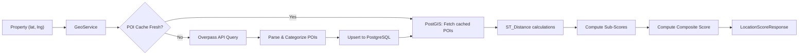

# 14 — Geospatial System

## Overview

DataSage's geospatial subsystem uses PostGIS for spatial queries and OpenStreetMap via the Overpass API for POI data. This document covers the OSM data extraction pipeline, POI categorization, proximity calculations, and the location scoring methodology.

---

## Architecture



---

## PostGIS Setup

### Extensions Required

```sql
CREATE EXTENSION IF NOT EXISTS postgis;
CREATE EXTENSION IF NOT EXISTS postgis_topology;  -- Not needed for MVP, but useful for future
```

### Coordinate Reference System

- **SRID**: 4326 (WGS 84) — standard GPS coordinate system
- **Column type**: `GEOGRAPHY(POINT, 4326)` — uses spheroidal distance calculations (meters)
- **Why GEOGRAPHY over GEOMETRY**: At Delhi-NCR's latitude (~28.6°N), 1 degree of longitude ≈ 97.5 km. Planar distance calculations (GEOMETRY) would introduce ~0.3% error. GEOGRAPHY gives exact results on the WGS 84 ellipsoid.

---

## OpenStreetMap Data Extraction

### Overpass API

The Overpass API is queried for POIs within a bounding box around a property's location.

### Query Template

```python
# datasage/geo/overpass_client.py
OVERPASS_QUERY_TEMPLATE = """
[out:json][timeout:{timeout}];
(
  // Schools
  node["amenity"="school"](around:{radius},{lat},{lng});
  way["amenity"="school"](around:{radius},{lat},{lng});

  // Hospitals & Clinics
  node["amenity"~"hospital|clinic"](around:{radius},{lat},{lng});
  way["amenity"~"hospital|clinic"](around:{radius},{lat},{lng});

  // Metro Stations
  node["railway"="station"]["station"="subway"](around:{radius},{lat},{lng});
  node["railway"="station"]["network"~"Delhi Metro|Rapid Metro"](around:{radius},{lat},{lng});

  // Bus Stops
  node["highway"="bus_stop"](around:{radius},{lat},{lng});

  // Parks & Gardens
  node["leisure"~"park|garden"](around:{radius},{lat},{lng});
  way["leisure"~"park|garden"](around:{radius},{lat},{lng});

  // Shopping
  node["shop"~"supermarket|mall|department_store"](around:{radius},{lat},{lng});
  way["shop"~"mall|department_store"](around:{radius},{lat},{lng});
  node["amenity"="marketplace"](around:{radius},{lat},{lng});

  // Restaurants & Cafes
  node["amenity"~"restaurant|cafe|fast_food"](around:{radius},{lat},{lng});

  // Banks & ATMs
  node["amenity"~"bank|atm"](around:{radius},{lat},{lng});
);
out center;
"""
```

### Rate Limiting

| Parameter | Value | Rationale |
|-----------|-------|-----------|
| Max requests/second | 2 | Overpass API fair use policy |
| Timeout per query | 30 seconds | Complex queries can be slow |
| Max retries | 3 | Overpass API can return 429 during peak |
| Retry backoff | Exponential: 2s, 4s, 8s | |
| Query radius | 5,000 meters (configurable) | Covers walkable + drivable nearby amenities |

### Self-Hosted Overpass (Future)

For production with high query volume, host a private Overpass instance:
- Docker image: `wiktorn/overpass-api`
- Data: Delhi-NCR extract from Geofabrik
- Eliminates rate limits and dependency on public API

---

## POI Categorization

### OSM Tag → Category Mapping

| DataSage Category | OSM Tags | Icon |
|-------------------|----------|------|
| `school` | `amenity=school`, `amenity=college`, `amenity=university` | 🎓 |
| `hospital` | `amenity=hospital`, `amenity=clinic`, `healthcare=hospital` | 🏥 |
| `metro` | `railway=station` + `station=subway`, `network=~Delhi Metro` | 🚇 |
| `bus_stop` | `highway=bus_stop`, `amenity=bus_station` | 🚌 |
| `park` | `leisure=park`, `leisure=garden`, `landuse=recreation_ground` | 🌳 |
| `shopping` | `shop=supermarket`, `shop=mall`, `shop=department_store`, `amenity=marketplace` | 🛒 |
| `restaurant` | `amenity=restaurant`, `amenity=cafe`, `amenity=fast_food` | 🍽️ |
| `bank` | `amenity=bank`, `amenity=atm` | 🏦 |

### POI Parsing

```python
# datasage/geo/poi_processor.py
def parse_overpass_response(response: dict, property_coords: tuple) -> list[dict]:
    pois = []
    for element in response.get("elements", []):
        lat = element.get("lat") or element.get("center", {}).get("lat")
        lng = element.get("lon") or element.get("center", {}).get("lon")
        if not lat or not lng:
            continue

        category = categorize_element(element.get("tags", {}))
        if not category:
            continue

        pois.append({
            "osm_id": f"{element['type']}/{element['id']}",
            "name": element.get("tags", {}).get("name", ""),
            "category": category,
            "latitude": lat,
            "longitude": lng,
            "tags": element.get("tags", {}),
        })
    return pois
```

---

## POI Caching Strategy

| Aspect | Value | Rationale |
|--------|-------|-----------|
| Cache location | PostgreSQL `poi` table | Persistent, queryable, spatial-indexed |
| Cache key | `osm_id` (globally unique) | Deduplicates POIs shared between properties |
| Cache TTL | 30 days | OSM data changes slowly. Monthly refresh balances freshness vs. API load. |
| Freshness check | `property_location.poi_last_refreshed` | Per-property check before querying Overpass |
| Refresh trigger | On property detail view if stale; scheduled batch job | |

### Batch Refresh Job (Background)

```python
# Scheduled to run weekly
async def refresh_stale_pois():
    """Re-query Overpass for properties with stale POI data."""
    stale_locations = await poi_repo.get_stale_locations(days=30)
    for location in stale_locations:
        pois = await overpass_client.query(location.lat, location.lng)
        await poi_repo.upsert_pois(pois, city_id=location.city_id)
        await poi_repo.update_refresh_timestamp(location.id)
        await asyncio.sleep(0.5)  # Rate limiting
```

---

## Location Scoring Methodology

### Composite Score Formula

```
location_score = Σ (weight_i × sub_score_i) for each POI category
```

Where weights are configurable per city:

### Default Weights (Delhi-NCR)

| Category | Weight | Rationale |
|----------|--------|-----------|
| Transit (metro + bus) | 0.30 | Delhi-NCR is transit-dependent. Metro proximity is the #1 location factor. |
| Schools | 0.20 | Family buyers prioritize schools heavily. |
| Healthcare | 0.15 | Hospital access is a baseline expectation. |
| Shopping | 0.15 | Convenience factor — daily needs. |
| Parks/Green | 0.10 | Quality of life factor. |
| Restaurants/Dining | 0.10 | Lifestyle/convenience indicator. |
| **Total** | **1.00** | |

### Sub-Score Calculation

Each category sub-score (0–100) is computed from:

1. **Nearest distance score** (0–100): How close is the nearest POI of this category?

```python
def distance_score(distance_m: float, ideal_m: float, max_m: float) -> float:
    """
    Score based on distance:
    - At or within ideal_m: score = 100
    - At max_m: score = 0
    - Between: linear interpolation
    """
    if distance_m <= ideal_m:
        return 100.0
    if distance_m >= max_m:
        return 0.0
    return 100.0 * (1 - (distance_m - ideal_m) / (max_m - ideal_m))
```

2. **Count bonus** (0–20): Number of POIs within radius adds a bonus.

```python
def count_bonus(count: int, expected: int) -> float:
    """Bonus score for having multiple options (max 20 points)."""
    return min(20.0, 20.0 * count / expected)
```

3. **Combined sub-score**:

```python
sub_score = min(100, 0.7 * distance_score + 0.3 * count_bonus)
```

### Category Parameters

| Category | Ideal Distance | Max Distance | Expected Count | Radius |
|----------|---------------|-------------|----------------|--------|
| Metro | 500m | 5,000m | 2 within 5 km | 5 km |
| School | 500m | 3,000m | 3 within 2 km | 2 km |
| Hospital | 1,000m | 5,000m | 2 within 3 km | 3 km |
| Shopping | 500m | 3,000m | 3 within 3 km | 3 km |
| Park | 300m | 2,000m | 2 within 2 km | 2 km |
| Restaurant | 300m | 2,000m | 5 within 1 km | 1 km |

---

## Spatial Queries

### Key PostGIS Queries

```sql
-- Find all POIs within 5 km of a property
SELECT poi.id, poi.name, poi.category,
       ST_Distance(poi.coordinates, pl.coordinates) AS distance_m
FROM poi
JOIN property_location pl ON pl.property_id = :property_id
WHERE ST_DWithin(poi.coordinates, pl.coordinates, 5000)
  AND poi.city_id = :city_id
ORDER BY poi.category, distance_m;

-- Find nearest POI per category
SELECT DISTINCT ON (category)
    category,
    name,
    ST_Distance(coordinates, :prop_coords) AS distance_m
FROM poi
WHERE ST_DWithin(coordinates, :prop_coords, 10000)
  AND city_id = :city_id
ORDER BY category, distance_m;

-- Properties near a point (map viewport search)
SELECT p.*
FROM property p
JOIN property_location pl ON p.id = pl.property_id
WHERE ST_DWithin(pl.coordinates, ST_MakePoint(:lng, :lat)::geography, :radius_m)
  AND p.is_active = true
  AND p.deleted_at IS NULL;
```

---

## Delhi-NCR Configuration

### Bounding Box

```python
DELHI_NCR_BBOX = {
    "lat_min": 28.30,
    "lat_max": 28.90,
    "lng_min": 76.80,
    "lng_max": 77.60,
    "cities": [
        {"name": "Delhi", "id": 1},
        {"name": "Gurgaon", "id": 2},
        {"name": "Noida", "id": 3},
        {"name": "Greater Noida", "id": 4},
        {"name": "Faridabad", "id": 5},
        {"name": "Ghaziabad", "id": 6},
    ]
}
```

### Validation

All property coordinates are validated against the city bounding box during ingestion. Coordinates outside the box are flagged in data quality reports.

---

## Testing the Geospatial System

| Test Type | What | How |
|-----------|------|-----|
| Unit: scoring | Score calculation with known distances | Fixed inputs → expected scores |
| Unit: POI parsing | Overpass response parsing | Mock Overpass JSON → expected POI list |
| Integration: PostGIS | Spatial query correctness | Seed test DB with known points → verify ST_DWithin results |
| Integration: Overpass | API connectivity and response format | Hit real API with known Delhi coordinates (in CI, use mock) |
| Regression: scores | Score stability across code changes | Snapshot test: same property → same score |

---

## Related Documents

- [09 — Database Design](09-database-design.md)
- [12 — ML System Design](12-ml-system-design.md)
- [13 — Feature Engineering](13-ml-feature-engineering.md)
- [17 — Data Ingestion](17-data-ingestion-pipeline.md)
