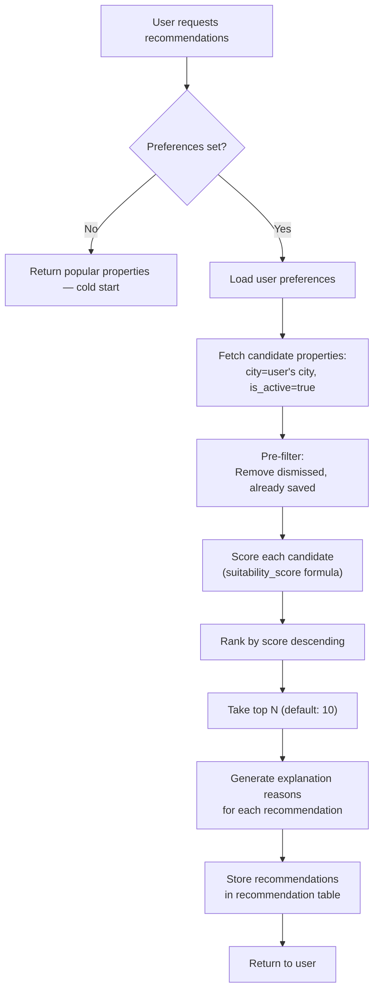

# 15 — Recommendation Engine

## Overview

DataSage uses a content-based filtering approach to recommend properties to users. Recommendations are generated by scoring each candidate property against the user's explicit preferences and presenting the highest-scoring matches with natural-language explanations.

---

## Approach: Content-Based Filtering

### Why Content-Based (Not Collaborative)

| Approach | Pros | Cons | Fit for DataSage |
|----------|------|------|------------------|
| Content-based | Works with explicit preferences, no cold-start for items, explainable | Doesn't discover unexpected preferences | ✅ Good — we have rich property features and explicit user preferences |
| Collaborative filtering | Discovers latent preferences, "users like you also liked" | Requires large user base (>10K active), cold-start for new users/items | ❌ Poor — MVP has small user base, sparse interaction data |
| Hybrid | Best of both | Complexity | Future — add collaborative signals when user base grows |

**Decision**: Content-based filtering for MVP. The recommendation engine scores properties against the user's stated preferences (budget, BHK, localities, commute, lifestyle priorities).

---

## Scoring Formula

### Composite Suitability Score

```
suitability_score = Σ (weight_i × component_score_i) × 100
```

### Score Components

| Component | Weight | Range | Calculation |
|-----------|--------|-------|-------------|
| Budget match | 0.25 | 0–1 | How well does the property price fit the user's budget range? |
| BHK match | 0.15 | 0 or 1 | Does the BHK match the user's preferred BHK list? |
| Locality match | 0.15 | 0 or 1 | Is the property in a preferred locality? |
| Commute score | 0.15 | 0–1 | How close is the property to the user's commute destination? |
| Lifestyle match | 0.15 | 0–1 | How well does the location score align with user's lifestyle priorities? |
| Value score | 0.10 | 0–1 | Is the property fairly or underpriced? |
| Property type match | 0.05 | 0 or 1 | Does the property type match preferences? |

### Component Details

#### Budget Match (0.25)

```python
def budget_score(listing_price, budget_min, budget_max):
    if budget_min <= listing_price <= budget_max:
        # Within budget: score based on how centered
        mid = (budget_min + budget_max) / 2
        range_half = (budget_max - budget_min) / 2
        deviation = abs(listing_price - mid) / range_half
        return 1.0 - (0.3 * deviation)  # 0.7–1.0 within range
    elif listing_price < budget_min:
        # Below budget (good): slight penalty for being too cheap
        gap = (budget_min - listing_price) / budget_min
        return max(0.3, 1.0 - gap)
    else:
        # Over budget: sharp penalty
        gap = (listing_price - budget_max) / budget_max
        return max(0, 0.5 - gap * 2)
```

#### Commute Score (0.15)

```python
def commute_score(property_coords, commute_coords):
    """Score based on straight-line distance to commute destination."""
    distance_km = haversine(property_coords, commute_coords)
    if distance_km <= 5:
        return 1.0
    elif distance_km <= 15:
        return 1.0 - (distance_km - 5) / 20  # Linear decay
    elif distance_km <= 30:
        return 0.5 - (distance_km - 15) / 30
    else:
        return 0.0
```

#### Lifestyle Match (0.15)

Maps user's lifestyle priority ordering to location sub-scores:

```python
def lifestyle_score(location_sub_scores, lifestyle_priorities):
    """
    lifestyle_priorities: ordered list like ["metro", "schools", "parks", ...]
    Assign weights: [0.35, 0.25, 0.20, 0.12, 0.08] to priorities
    """
    priority_weights = [0.35, 0.25, 0.20, 0.12, 0.08]
    category_map = {
        "metro": "transit",
        "schools": "schools",
        "parks": "parks",
        "shopping": "shopping",
        "hospitals": "healthcare",
    }
    score = 0
    for i, priority in enumerate(lifestyle_priorities[:5]):
        category = category_map.get(priority, priority)
        sub_score = location_sub_scores.get(category, {}).get("score", 50) / 100
        score += priority_weights[i] * sub_score
    return score
```

#### Value Score (0.10)

```python
def value_score(pricing_classification, price_gap_pct):
    if pricing_classification == "underpriced":
        return min(1.0, 0.8 + abs(price_gap_pct) / 100)
    elif pricing_classification == "fair":
        return 0.6
    else:  # overpriced
        return max(0, 0.4 - abs(price_gap_pct) / 100)
```

---

## Recommendation Pipeline



### Candidate Selection (Pre-Filtering)

To avoid scoring all 50K properties, pre-filter:

```sql
SELECT p.id FROM property p
WHERE p.city_id = :city_id
  AND p.is_active = true
  AND p.deleted_at IS NULL
  AND p.listing_price BETWEEN :budget_min * 0.8 AND :budget_max * 1.2  -- 20% buffer
  AND p.bhk = ANY(:bhk_preferences)  -- If BHK set
  AND p.id NOT IN (SELECT property_id FROM saved_property WHERE user_id = :user_id)
  AND p.id NOT IN (SELECT property_id FROM recommendation WHERE user_id = :user_id AND status = 'dismissed')
LIMIT 500;  -- Score at most 500 candidates
```

---

## Cold-Start Handling

| Scenario | Strategy | Output |
|----------|----------|--------|
| No preferences at all | Return most-viewed / highest-rated properties in the user's city | Generic popularity-based list |
| Budget only | Filter by budget, sort by location score | Budget-filtered, location-sorted |
| Partial preferences | Score with available components, normalize weights | Degraded but personalized results |
| No matching properties | Relax constraints (expand budget by 20%, expand BHK range) | Show closest matches with relaxation note |

---

## Explanation Generation

Each recommendation includes 2–4 reasons explaining why it was selected:

```python
def generate_reasons(property, user_prefs, component_scores) -> list[dict]:
    reasons = []

    if component_scores['budget'] > 0.8:
        reasons.append({
            "type": "budget_match",
            "text": f"Within your budget (₹{format_inr(user_prefs.budget_min)}–₹{format_inr(user_prefs.budget_max)})",
            "contribution": component_scores['budget'],
        })

    if component_scores['bhk'] == 1.0:
        reasons.append({
            "type": "bhk_match",
            "text": f"{property.bhk} BHK as preferred",
            "contribution": component_scores['bhk'],
        })

    if component_scores['commute'] > 0.7:
        distance = haversine(property_coords, user_prefs.commute_destination)
        reasons.append({
            "type": "commute",
            "text": f"{distance:.0f} km from your commute destination",
            "contribution": component_scores['commute'],
        })

    if component_scores['lifestyle'] > 0.7:
        top_priority = user_prefs.lifestyle_priorities[0]
        reasons.append({
            "type": "lifestyle",
            "text": f"Strong on your top priority: {top_priority}",
            "contribution": component_scores['lifestyle'],
        })

    if property.pricing_classification == "underpriced":
        reasons.append({
            "type": "value",
            "text": f"Underpriced by {abs(property.price_gap_pct):.1f}% — potential good deal",
            "contribution": component_scores['value'],
        })

    return reasons[:4]  # Max 4 reasons
```

---

## Recommendation Freshness

| Aspect | Strategy |
|--------|----------|
| Computation | On-demand (when user visits dashboard/recommendations page) |
| Caching | Store computed recommendations in `recommendation` table. TTL: 24 hours. |
| Invalidation | Recompute when: user updates preferences, new dataset imported, 24 hours elapsed |
| Staleness indicator | Show "Last updated: [timestamp]" on recommendation section |

---

## Future Enhancements

| Enhancement | Description | When |
|-------------|-------------|------|
| Collaborative filtering | "Users with similar preferences also liked…" | When user base > 10K active users |
| Implicit feedback | Track property view duration, clicks, map interactions | Phase 2 |
| Diversity injection | Ensure recommendations include properties from multiple localities | Phase 2 |
| Re-ranking for freshness | Boost newly listed properties | Phase 2 |
| ML-based scoring | Replace rule-based scoring with a learned ranking model | Phase 3 |

---

## Related Documents

- [02 — User Personas](02-user-personas.md)
- [04 — Functional Requirements](04-functional-requirements.md)
- [14 — Geospatial System](14-geospatial-system.md)
- [16 — Explainable AI](16-explainable-ai.md)
