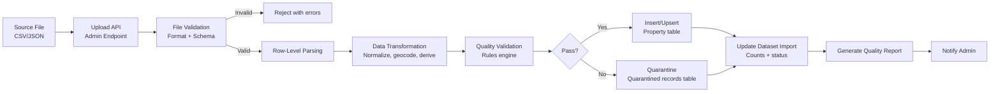

# 17 — Data Ingestion Pipeline

## Overview

DataSage ingests property data from multiple sources into a normalized PostgreSQL schema. This document covers data sources, the ETL pipeline, scheduling, idempotency, and data versioning.

---

## Data Sources

| Source | Type | Format | Availability | Usage |
|--------|------|--------|-------------|-------|
| Synthetic seed data | Generated | CSV/JSON | Created by us | Development and demo. Clearly labeled as synthetic. |
| Delhi circle rates | Government | PDF → CSV (manual extraction) | Annual publication | Baseline per-locality rates by property type. Used as features + validation. |
| DDA auction results | Government | PDF/HTML → CSV | Sporadic | Historical price reference points. |
| OpenStreetMap POIs | Open API | JSON (Overpass) | Real-time | POI data for geospatial features. Handled by geospatial subsystem, not this pipeline. |
| User-uploaded datasets | Manual | CSV/JSON | Admin upload | Primary property listing data for the platform. |

> **Important**: We do not claim access to commercial property portal APIs (MagicBricks, 99acres, Housing.com). If such access becomes available in the future, this pipeline can ingest their data via adapter modules.

---

## ETL Pipeline Architecture



---

## Ingestion Flow (Detailed)

### Step 1: File Upload

```python
# Admin uploads CSV/JSON via POST /admin/datasets/upload
@router.post("/admin/datasets/upload")
async def upload_dataset(
    file: UploadFile,
    dataset_name: str,
    user = Depends(require_role("admin")),
):
    # Validate file type
    if file.content_type not in ["text/csv", "application/json"]:
        raise ValidationError("Unsupported file type. Use CSV or JSON.")

    # Validate file size (max 50 MB)
    if file.size > 50 * 1024 * 1024:
        raise ValidationError("File exceeds 50 MB limit.")

    # Create dataset and import records
    dataset = await dataset_service.create_dataset(dataset_name, user.id)
    import_record = await dataset_service.start_import(dataset.id, file.filename, user.id)

    # Process in background
    background_tasks.add_task(
        process_import, import_record.id, file, dataset.id
    )

    return {"dataset_id": dataset.id, "import_id": import_record.id, "status": "processing"}
```

### Step 2: Schema Validation

Expected CSV columns (required marked with *):

| Column | Type | Required | Notes |
|--------|------|----------|-------|
| locality* | string | ✅ | Must match a known locality name |
| property_type* | string | ✅ | apartment, builder_floor, house, plot |
| bhk* | integer | ✅ | 1–10 |
| area_sqft* | float | ✅ | > 0 |
| listing_price* | integer | ✅ | > 0, INR |
| latitude | float | ❌ | WGS 84. If missing, geocoded from locality centroid. |
| longitude | float | ❌ | WGS 84 |
| floor_number | integer | ❌ | |
| total_floors | integer | ❌ | |
| facing | string | ❌ | north, south, east, west, etc. |
| construction_year | integer | ❌ | 1950–current+5 |
| furnishing | string | ❌ | unfurnished, semi_furnished, fully_furnished |
| parking_count | integer | ❌ | ≥ 0 |
| balcony_count | integer | ❌ | ≥ 0 |
| bathroom_count | integer | ❌ | ≥ 0 |
| description | text | ❌ | |
| listed_at | datetime | ❌ | ISO 8601 or DD/MM/YYYY |

### Step 3: Row-Level Transformation

```python
def transform_row(raw: dict, locality_map: dict, city_id: int) -> dict:
    # Normalize locality name
    locality_name = raw["locality"].strip().lower()
    locality = locality_map.get(locality_name)
    if not locality:
        raise RowValidationError(f"Unknown locality: {raw['locality']}")

    # Geocode if coordinates missing
    lat = raw.get("latitude") or locality.centroid_lat
    lng = raw.get("longitude") or locality.centroid_lng

    # Normalize property type
    property_type = normalize_property_type(raw["property_type"])

    # Parse and validate price
    price = int(raw["listing_price"])
    if price <= 0:
        raise RowValidationError("listing_price must be positive")

    return {
        "city_id": city_id,
        "locality_id": locality.id,
        "property_type": property_type,
        "bhk": int(raw["bhk"]),
        "area_sqft": float(raw["area_sqft"]),
        "listing_price": price,
        "latitude": float(lat),
        "longitude": float(lng),
        "floor_number": safe_int(raw.get("floor_number")),
        "total_floors": safe_int(raw.get("total_floors")),
        "facing": normalize_facing(raw.get("facing")),
        "construction_year": safe_int(raw.get("construction_year")),
        "furnishing": normalize_furnishing(raw.get("furnishing")),
        "parking_count": safe_int(raw.get("parking_count"), default=0),
        "balcony_count": safe_int(raw.get("balcony_count"), default=0),
        "bathroom_count": safe_int(raw.get("bathroom_count")),
        "description": raw.get("description", ""),
        "data_source": "import",
    }
```

### Step 4: Quality Validation

Applied per-row after transformation. See [18 — Data Quality](18-data-quality.md) for full rules.

### Step 5: Insert/Quarantine

- Valid rows: Bulk INSERT into `property` table with `dataset_import_id` reference.
- Invalid rows: INSERT into a quarantine table with error reason. Admin reviews.

### Step 6: Quality Report Generation

After import completes:

```python
report = {
    "total_rows": total,
    "valid_rows": valid_count,
    "quarantined_rows": quarantined_count,
    "issues": {
        "missing_required_fields": count_by_field,
        "invalid_coordinates": coord_error_count,
        "price_outliers": outlier_count,
        "unknown_localities": unknown_count,
    },
    "completeness_score": valid_count / total * 100,
    "validity_score": ...,
}
```

---

## Idempotency

- Each import creates a new `DatasetImport` record with a unique ID.
- Properties created by an import are linked via `dataset_import_id`.
- Re-importing the same file creates a new import — old records are not affected.
- To replace data: admin archives the old dataset, activates the new one.
- Duplicate detection: properties with identical (locality, bhk, area_sqft, listing_price, floor_number) within the same dataset are flagged as potential duplicates in the quality report.

---

## Seed Data Generation

For development and demo purposes, a CLI command generates synthetic seed data:

```bash
docker compose exec backend python -m datasage.cli seed --demo --count 1000
```

The seed data generator:
1. Uses realistic Delhi-NCR localities from the locality reference table
2. Generates property attributes with distributions matching the Delhi-NCR market
3. Adds noise to prevent unrealistic uniformity
4. Clearly marks all records with `data_source='seed'`
5. Does NOT claim to be real property listings

---

## Related Documents

- [18 — Data Quality](18-data-quality.md)
- [09 — Database Design](09-database-design.md)
- [14 — Geospatial System](14-geospatial-system.md)
