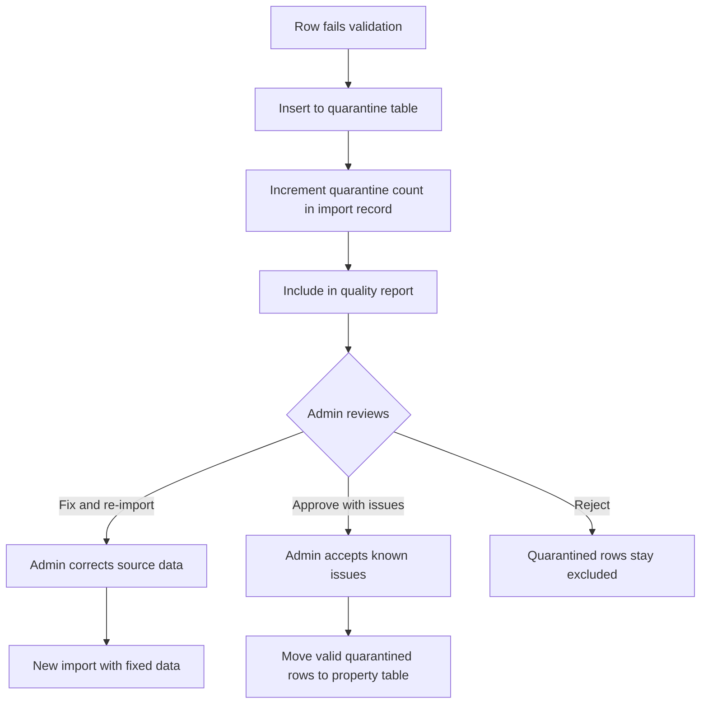

# 18 — Data Quality

## Overview

Data quality directly impacts ML model accuracy and user trust. This document defines validation rules, completeness checks, anomaly detection, quality scoring, the quarantine workflow, and quality reporting.

---

## Quality Dimensions

| Dimension | Definition | Measurement |
|-----------|-----------|-------------|
| Completeness | % of required fields populated | Count of non-null values per required column |
| Validity | Values conform to expected types, ranges, and formats | Rule-based validation per column |
| Consistency | No contradictory values within a record | Cross-field validation rules |
| Uniqueness | No duplicate records | Deduplication check on key field combinations |
| Accuracy | Values reflect reality | Statistical outlier detection; manual spot-checks |
| Timeliness | Data is current | Listing date vs. import date gap |

---

## Validation Rules

### Required Field Checks

| Field | Rule | Error Code |
|-------|------|-----------|
| locality | Not null, must match known locality | `MISSING_LOCALITY` / `UNKNOWN_LOCALITY` |
| property_type | Not null, in allowed enum | `MISSING_PROPERTY_TYPE` / `INVALID_PROPERTY_TYPE` |
| bhk | Not null, integer 1–10 | `MISSING_BHK` / `INVALID_BHK` |
| area_sqft | Not null, > 0, < 50000 | `MISSING_AREA` / `INVALID_AREA` |
| listing_price | Not null, > 0 | `MISSING_PRICE` / `INVALID_PRICE` |

### Range Checks

| Field | Min | Max | Error Code |
|-------|-----|-----|-----------|
| listing_price | ₹100,000 (1 lakh) | ₹1,000,000,000 (100 crore) | `PRICE_OUT_OF_RANGE` |
| area_sqft | 100 | 50,000 | `AREA_OUT_OF_RANGE` |
| bhk | 1 | 10 | `BHK_OUT_OF_RANGE` |
| floor_number | 0 (ground) | 100 | `FLOOR_OUT_OF_RANGE` |
| construction_year | 1950 | current_year + 5 | `YEAR_OUT_OF_RANGE` |
| latitude | 28.30 | 28.90 (Delhi-NCR) | `COORDS_OUT_OF_BOUNDS` |
| longitude | 76.80 | 77.60 (Delhi-NCR) | `COORDS_OUT_OF_BOUNDS` |

### Consistency Checks

| Rule | Validation | Error Code |
|------|-----------|-----------|
| Floor vs total floors | floor_number ≤ total_floors | `FLOOR_EXCEEDS_TOTAL` |
| BHK vs area | area_sqft ≥ bhk × 200 (min 200 sqft per room) | `AREA_TOO_SMALL_FOR_BHK` |
| BHK vs bathrooms | bathroom_count ≤ bhk + 2 | `TOO_MANY_BATHROOMS` |
| Price per sqft | ₹1,000 ≤ price/area ≤ ₹100,000 | `PRICE_PER_SQFT_OUTLIER` |
| Plot type constraints | property_type == 'plot' → floor_number is null | `PLOT_HAS_FLOOR` |

### Statistical Outlier Detection

```python
def detect_outliers(df: pd.DataFrame, column: str, method: str = "iqr") -> pd.Series:
    """Flag rows where column value is a statistical outlier."""
    if method == "iqr":
        Q1 = df[column].quantile(0.25)
        Q3 = df[column].quantile(0.75)
        IQR = Q3 - Q1
        lower = Q1 - 3 * IQR  # Using 3× IQR (more lenient than 1.5×)
        upper = Q3 + 3 * IQR
        return (df[column] < lower) | (df[column] > upper)
```

Applied to: `listing_price`, `area_sqft`, `price_per_sqft` (derived). Outliers are flagged but not auto-quarantined — they may be legitimate luxury/budget properties.

---

## Quality Scoring

Each dataset import receives a quality score:

```python
def compute_quality_scores(total_rows, issues_by_type):
    valid_rows = total_rows - sum(issues_by_type.values())

    completeness = sum(
        1 for row in rows if all(row[f] is not None for f in REQUIRED_FIELDS)
    ) / total_rows * 100

    validity = valid_rows / total_rows * 100

    return {
        "completeness_score": round(completeness, 1),
        "validity_score": round(validity, 1),
        "overall_score": round((completeness + validity) / 2, 1),
    }
```

### Quality Thresholds

| Score | Rating | Admin Action |
|-------|--------|-------------|
| ≥ 90% | Excellent | Auto-approve for activation |
| 70–89% | Acceptable | Review quarantined records, approve |
| 50–69% | Poor | Fix issues in source data, re-import |
| < 50% | Unacceptable | Reject entire import |

---

## Quarantine Workflow



### Quarantine Table

```sql
CREATE TABLE quarantined_record (
    id UUID PRIMARY KEY DEFAULT gen_random_uuid(),
    dataset_import_id UUID NOT NULL REFERENCES dataset_import(id),
    row_number INTEGER NOT NULL,
    raw_data JSONB NOT NULL,          -- Original row data
    errors JSONB NOT NULL,            -- List of error codes + messages
    status VARCHAR(20) DEFAULT 'pending',  -- pending, approved, rejected
    reviewed_by UUID REFERENCES "user"(id),
    reviewed_at TIMESTAMPTZ,
    created_at TIMESTAMPTZ DEFAULT now()
);
```

---

## Data Profiling

On each import, generate a statistical profile of the dataset:

```python
def profile_dataset(df: pd.DataFrame) -> dict:
    return {
        "row_count": len(df),
        "columns": {
            col: {
                "dtype": str(df[col].dtype),
                "null_count": int(df[col].isnull().sum()),
                "null_pct": round(df[col].isnull().mean() * 100, 1),
                "unique_count": int(df[col].nunique()),
                "min": format_value(df[col].min()),
                "max": format_value(df[col].max()),
                "mean": format_value(df[col].mean()) if df[col].dtype in ("float64", "int64") else None,
                "median": format_value(df[col].median()) if df[col].dtype in ("float64", "int64") else None,
                "std": format_value(df[col].std()) if df[col].dtype in ("float64", "int64") else None,
            }
            for col in df.columns
        },
        "locality_distribution": df["locality"].value_counts().head(20).to_dict(),
        "property_type_distribution": df["property_type"].value_counts().to_dict(),
        "bhk_distribution": df["bhk"].value_counts().sort_index().to_dict(),
    }
```

---

## Quality Report Format

Stored in the `data_quality_report` table and displayed in the admin dashboard:

```json
{
  "import_id": "import-uuid",
  "summary": {
    "total_rows": 5000,
    "valid_rows": 4753,
    "quarantined_rows": 247,
    "completeness_score": 95.1,
    "validity_score": 93.2,
    "overall_score": 94.2
  },
  "issues": [
    {"code": "MISSING_AREA", "count": 23, "severity": "error", "sample_rows": [45, 122, 340]},
    {"code": "PRICE_OUT_OF_RANGE", "count": 18, "severity": "error", "sample_rows": [89, 201]},
    {"code": "COORDS_OUT_OF_BOUNDS", "count": 6, "severity": "error", "sample_rows": [50, 99]},
    {"code": "PRICE_PER_SQFT_OUTLIER", "count": 147, "severity": "warning", "sample_rows": [5, 33, 77]},
    {"code": "UNKNOWN_LOCALITY", "count": 53, "severity": "error", "sample_rows": [10, 22]}
  ],
  "profile": { /* dataset profile */ },
  "generated_at": "2026-09-21T15:30:00+05:30"
}
```

---

## Related Documents

- [17 — Data Ingestion Pipeline](17-data-ingestion-pipeline.md)
- [09 — Database Design](09-database-design.md)
- [12 — ML System Design](12-ml-system-design.md)
