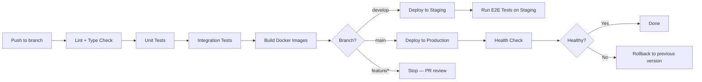

# 24 — Deployment

## Overview

DataSage uses Docker for containerization, with Docker Compose for local development and a CI/CD pipeline for staging and production environments.

---

## Environments

| Environment | Purpose | Access | Deployment |
|-------------|---------|--------|------------|
| Development | Local dev on engineer's machine | localhost | `docker compose up` |
| Staging | Pre-production testing | Internal team | CI/CD on merge to `develop` branch |
| Production | Live system | Public | CI/CD on merge to `main` branch |

---

## Docker Images

### Backend Dockerfile

```dockerfile
# docker/backend.Dockerfile
FROM python:3.11-slim AS base

WORKDIR /app
RUN apt-get update && apt-get install -y --no-install-recommends \
    libpq-dev gcc && \
    rm -rf /var/lib/apt/lists/*

COPY backend/requirements.txt .
RUN pip install --no-cache-dir -r requirements.txt

COPY backend/ ./backend/

# Production stage
FROM base AS production
ENV APP_DEBUG=false
CMD ["uvicorn", "datasage.main:app", "--host", "0.0.0.0", "--port", "8000", "--workers", "4"]

# Development stage
FROM base AS development
RUN pip install --no-cache-dir debugpy pytest
CMD ["uvicorn", "datasage.main:app", "--host", "0.0.0.0", "--port", "8000", "--reload"]
```

### Frontend Dockerfile

```dockerfile
# docker/frontend.Dockerfile
FROM node:18-alpine AS base

WORKDIR /app
COPY frontend/package.json frontend/package-lock.json ./
RUN npm ci

COPY frontend/ .

# Production
FROM base AS production
RUN npm run build
CMD ["npm", "start"]

# Development
FROM base AS development
CMD ["npm", "run", "dev"]
```

---

## CI/CD Pipeline



### Pipeline Stages

| Stage | Tools | Duration Target |
|-------|-------|----------------|
| Lint + Type Check | ruff, mypy, eslint, tsc | < 1 min |
| Unit Tests | pytest, jest | < 3 min |
| Integration Tests | pytest + test DB | < 5 min |
| Build Images | Docker BuildKit | < 3 min |
| Deploy | Docker Compose / cloud deploy | < 2 min |
| E2E Tests | Playwright | < 5 min |
| **Total** | | **< 15 min** |

---

## Database Migrations

### Migration Workflow

```bash
# Generate migration
alembic revision --autogenerate -m "add_investment_score_column"

# Review generated migration (always review auto-generated SQL)
# Apply migration
alembic upgrade head

# Rollback one step
alembic downgrade -1
```

### Migration Rules

1. Every migration has a `downgrade()` function.
2. Migrations are applied automatically on deployment (via startup script or CI step).
3. Schema migrations are separate from data migrations.
4. Destructive operations (DROP COLUMN) are preceded by a deprecation release.
5. Long-running migrations (large table ALTER) use `CREATE INDEX CONCURRENTLY` to avoid table locks.

---

## Rollback Strategy

| Scenario | Rollback Method | RTO |
|----------|----------------|-----|
| Bad code deploy | Redeploy previous Docker image tag | < 5 min |
| Bad migration (schema) | `alembic downgrade -1` | < 10 min |
| Bad migration (data) | Restore from latest backup | < 1 hour |
| Infrastructure failure | Restart containers / re-provision | < 30 min |

---

## Backup Strategy

| Data | Method | Frequency | Retention |
|------|--------|-----------|-----------|
| PostgreSQL | `pg_dump` to compressed file | Hourly (production) | 7 days of hourly, 30 days of daily |
| Redis | RDB snapshots | Hourly | 24 hours |
| ML model artifacts | Versioned in model store | On each training | Permanent |
| Environment config | Version controlled (.env.example) | Always | In git |

---

## Production Checklist

- [ ] `APP_DEBUG=false`
- [ ] `APP_ENV=production`
- [ ] Swagger UI disabled (`docs_url=None`)
- [ ] CORS restricted to production frontend domain
- [ ] JWT_SECRET_KEY is production-unique (≥64 chars)
- [ ] HTTPS enabled (TLS certificate configured)
- [ ] Database password is strong and unique
- [ ] Redis password is set
- [ ] Rate limiting is enabled
- [ ] Health check endpoint accessible
- [ ] Backup cron job configured
- [ ] Monitoring/alerting configured
- [ ] Error tracking (Sentry) configured
- [ ] Log aggregation configured

---

## Related Documents

- [06 — System Architecture](06-system-architecture.md)
- [22 — Observability](22-observability.md)
- [25 — Environment Configuration](25-environment-configuration.md)
