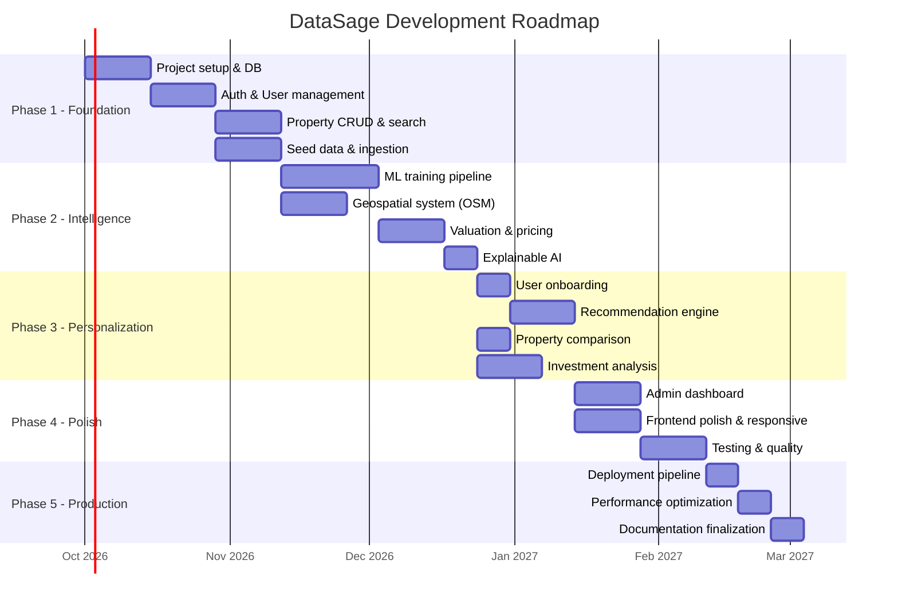
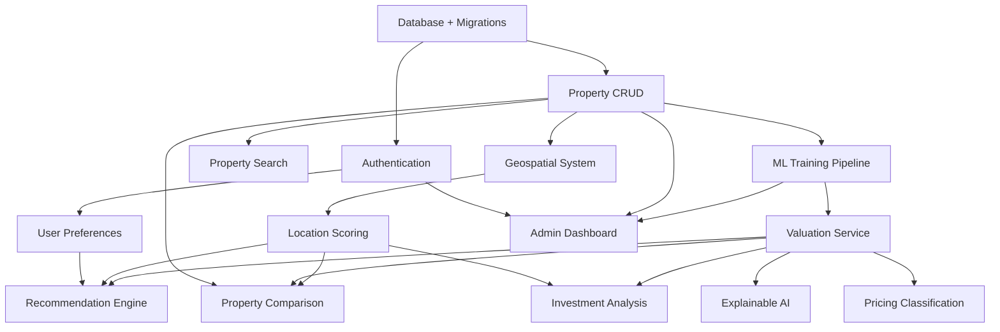

# 27 — Development Roadmap

## Overview

DataSage is developed in 5 phases, each delivering a usable increment. Phase 1 and 2 constitute the MVP.

---

## Phase Overview

---

## Phase 1: Foundation (Weeks 1–8)

**Goal**: Functional backend with auth, property data, and basic search.

| Week | Milestone | Deliverables |
|------|-----------|-------------|
| 1–2 | Project setup | Docker Compose, PostgreSQL+PostGIS, FastAPI scaffold, Next.js scaffold, Alembic migrations |
| 3–4 | Authentication | Registration, login, JWT tokens, password reset, RBAC, user profile |
| 5–6 | Property data | Property model, CRUD API, seed data generator, CSV import |
| 7–8 | Search | Locality autocomplete, property search with filters, pagination, result cards |

**Exit criteria**: A user can register, log in, search for properties, and view property details.

---

## Phase 2: Intelligence (Weeks 9–15)

**Goal**: ML valuation, geospatial analysis, and explainable AI.

| Week | Milestone | Deliverables |
|------|-----------|-------------|
| 9–11 | ML pipeline | Feature engineering, XGBoost training, evaluation, model serialization |
| 9–10 | Geospatial | Overpass API integration, POI caching, location scoring |
| 12–13 | Valuation | Prediction API, confidence intervals, pricing classification |
| 14 | Explainability | SHAP integration, explanation templates, natural language generation |
| 15 | Integration | Property detail page with full AI analysis section |

**Exit criteria**: Property detail pages show predicted fair value, pricing classification, location score, nearby amenities on a map, and AI explanations.

---

## Phase 3: Personalization (Weeks 16–20)

**Goal**: User preferences, recommendations, comparison, and investment analysis.

| Week | Milestone | Deliverables |
|------|-----------|-------------|
| 16 | Onboarding | Multi-step preference wizard, preference API |
| 17–18 | Recommendations | Scoring engine, candidate filtering, explanation generation |
| 16 | Comparison | Comparison list, side-by-side table, best-pick logic |
| 17–18 | Investment | Investment scoring, locality trends, rental yield estimates |
| 19–20 | Dashboard | User dashboard with recommendations, saved properties, search history |

**Exit criteria**: Users can set preferences, receive personalized recommendations with explanations, compare properties, and view investment analysis.

---

## Phase 4: Polish (Weeks 21–24)

**Goal**: Admin features, UI polish, and comprehensive testing.

| Week | Milestone | Deliverables |
|------|-----------|-------------|
| 21–22 | Admin dashboard | System health, dataset management, model management, user management, audit logs |
| 21–22 | UI polish | Responsive design, loading states, error states, empty states, animations |
| 23–24 | Testing | Unit tests (>80% coverage), integration tests, E2E tests, accessibility audit |

**Exit criteria**: Admin can manage datasets and models. All user flows work on mobile. Test coverage >80%.

---

## Phase 5: Production (Weeks 25–27)

**Goal**: Production-ready deployment and optimization.

| Week | Milestone | Deliverables |
|------|-----------|-------------|
| 25 | Deployment | CI/CD pipeline, Docker builds, staging environment, production checklist |
| 26 | Performance | API latency optimization, frontend bundle optimization, caching tuning |
| 27 | Finalization | Documentation review, CHANGELOG update, launch preparation |

**Exit criteria**: System deployed to production, all performance targets met, documentation complete.

---

## Module Dependency Graph

---

## Related Documents

- [28 — MVP vs Future Scope](28-mvp-vs-future-scope.md)
- [04 — Functional Requirements](04-functional-requirements.md)
- [30 — Acceptance Criteria](30-acceptance-criteria.md)
